# InternshipWala — Database Design Document

> **Platform:** [https://www.internshipwala.com](https://www.internshipwala.com)
> **Company:** Cloudtechz InternshipWALA Private Limited
> **Document Type:** Database Design Document v1.1 (Production-Ready)
> **Date:** June 28, 2026
> **Stack:** PostgreSQL (Neon) · Node.js · Express.js · React.js · Vite · Tailwind CSS · JWT Auth
> **Deployment:** Vercel · Render · Neon PostgreSQL
> **Review Status:** ✅ Approved — All critical issues resolved

---

## Changelog

| Version | Date | Author | Summary |
|---------|------|--------|---------|
| v1.0 | June 28, 2026 | DB Design Team | First-pass schema — 40 tables |
| v1.1 | June 28, 2026 | DB Design Team | Applied review panel corrections: CRITICAL-1 (re-enrollment partial index), CRITICAL-2 (admin soft delete), REC-1 through REC-8 |

---

## Table of Contents

1. [Introduction](#1-introduction)
2. [Database Overview](#2-database-overview)
3. [Entity Identification](#3-entity-identification)
4. [Entity Relationship Diagram](#4-entity-relationship-diagram)
5. [Table Design](#5-table-design)
6. [Relationship Analysis](#6-relationship-analysis)
7. [Database Normalization](#7-database-normalization)
8. [Index Strategy](#8-index-strategy)
9. [SQL Schema](#9-sql-schema)
10. [Seed Data](#10-seed-data)
11. [Data Integrity Rules](#11-data-integrity-rules)
12. [Performance Considerations](#12-performance-considerations)
13. [Security Considerations](#13-security-considerations)
14. [Future Scalability](#14-future-scalability)
15. [Operations Runbook](#15-operations-runbook)

---

## 1. Introduction

### 1.1 Purpose

This document defines the complete relational database architecture for the rebuilt InternshipWala platform. It serves as the authoritative data design reference for backend development using Node.js and Express.js against a PostgreSQL database hosted on Neon. This is the v1.1 production-ready revision with all review panel corrections incorporated.

### 1.2 Scope

The schema covers every feature observed in the live platform at [https://www.internshipwala.com](https://www.internshipwala.com), including:

- Public-facing modules (home, about, board members, blogs, events, gallery)
- User authentication and profile management
- Internship/course catalog, enrollment, and module progression
- Assignment and quiz tracking
- Payment processing and refund management
- Certificate generation and hard-copy dispatch
- Admin control panel and role-based access control
- Notification, announcement, and support systems
- Jobs, study abroad, student chapters, and institutional collaborations

### 1.3 Objectives

| # | Objective |
|---|-----------|
| 1 | Preserve 100% of existing business features |
| 2 | Migrate from MySQL to PostgreSQL with improved data types and constraints |
| 3 | Introduce UUIDs for all primary keys |
| 4 | Apply proper normalization (3NF) across all entities |
| 5 | Design indexes that support dashboard, search, and reporting queries |
| 6 | Ensure schema is directly consumable by a Node.js + Express.js REST API |
| 7 | Support JWT-based stateless authentication |
| 8 | Pass all issues raised in the senior database architecture review |

### 1.4 Assumptions

- The backend will use Neon PostgreSQL (serverless-compatible connection pooling via `pg` or `drizzle-orm`).
- File uploads (photos, PDFs, certificates) are stored on an external object store (e.g., Cloudinary or S3-compatible). The database stores only URL/path strings.
- Payment gateway is Razorpay or PayU. The database records transaction IDs and status; actual money movement is handled externally.
- OTP verification is handled via SMTP/SMS. OTP codes are stored temporarily and purged after use by a scheduled cleanup job (see Section 15).
- Soft deletes are applied to entities that have referential history (users, courses, enrollments, job_listings, admin_users).

### 1.5 Constraints

- No Redis, Kafka, RabbitMQ, Docker Swarm, or microservices.
- No NoSQL databases.
- No AWS-specific services.
- Schema must be deployable on Neon PostgreSQL free/paid tier.
- All tables must be compatible with Drizzle ORM or Prisma ORM for Node.js integration.

---

## 2. Database Overview

### 2.1 Database Architecture

The database is a single-schema PostgreSQL relational database. All tables reside in the `public` schema. The design follows a monolithic relational model, appropriate for the platform's scale and deployment on Neon PostgreSQL.

```
Neon PostgreSQL (Cloud)
│
├── public schema
│   ├── Core:          users, admin_users, roles, permissions
│   ├── Catalog:       courses, course_categories, course_modules, course_duration_fees
│   ├── Learning:      enrollments, module_progress, assignments, assignment_submissions
│   ├── Finance:       payments, refunds
│   ├── Credentials:   certificates, certificate_hard_copy_requests
│   ├── CMS:           carousel_slides, testimonials, blog_posts, blog_categories
│   ├── Community:     events, student_chapters, board_members
│   ├── Collaboration: institution_collaborations, industry_academia_collaborations
│   ├── Jobs:          job_listings, job_applications
│   ├── Content:       video_gallery, online_projects, study_abroad_programs, study_abroad_applications
│   ├── Communication: notifications, contact_messages, announcements
│   └── System:        cms_pages, settings, activity_logs, otp_verifications
```

### 2.2 Why PostgreSQL

| Reason | Detail |
|--------|--------|
| ACID compliance | Guarantees transactional integrity for payments and enrollments |
| Rich data types | `JSONB`, `ENUM`, `UUID`, `TIMESTAMPTZ` reduce application-layer complexity |
| Advanced indexing | GIN, BTREE, and partial indexes for search and filtered queries |
| Neon compatibility | Neon is PostgreSQL-native; no adapter layer required |
| ORM support | First-class support in Prisma, Drizzle, and TypeORM |
| CHECK constraints | Enforce business rules at the database level |

### 2.3 Design Philosophy

- **UUID-first:** All primary keys are `UUID` generated by `gen_random_uuid()`. This avoids sequential ID enumeration and simplifies distributed inserts.
- **Timestamps everywhere:** Every table carries `created_at` and `updated_at` (`TIMESTAMPTZ`). `updated_at` is maintained by a trigger.
- **Soft deletes for financially-linked entities:** Tables with referential history use `deleted_at TIMESTAMPTZ NULL`. A `NULL` value means the record is active. This applies to `users`, `courses`, `enrollments`, `job_listings`, and `admin_users`.
- **ENUM types:** Status fields use PostgreSQL native `ENUM` types for database-level validation. `VARCHAR` status columns are not used anywhere in this schema.
- **Separation of concerns:** CMS content (banners, pages) is separated from transactional data (enrollments, payments).
- **Partial unique indexes over blanket unique constraints:** Where business logic requires conditional uniqueness (e.g., re-enrollment after cancellation), partial indexes are used instead of table-level `UNIQUE` constraints.

### 2.4 Naming Conventions

| Item | Convention | Example |
|------|-----------|---------|
| Tables | `snake_case`, plural | `course_modules` |
| Columns | `snake_case` | `full_name`, `created_at` |
| Primary keys | `id` (UUID) | `id UUID PRIMARY KEY` |
| Foreign keys | `<table_singular>_id` | `user_id`, `course_id` |
| Indexes | `idx_<table>_<column(s)>` | `idx_users_email` |
| ENUM types | `<domain>_status` or `<domain>_type` | `payment_status`, `course_type` |
| Junction tables | `<table1>_<table2>` | `role_permissions` |
| Named constraints | `uq_<table>_<column(s)>`, `chk_<table>_<rule>` | `uq_users_email`, `chk_cdf_fee` |

### 2.5 UUID Strategy

All tables use `UUID` as the primary key type.

```sql
id UUID PRIMARY KEY DEFAULT gen_random_uuid()
```

The `pgcrypto` extension (available on Neon by default) provides `gen_random_uuid()`.

### 2.6 Timestamp Strategy

```sql
created_at  TIMESTAMPTZ NOT NULL DEFAULT NOW(),
updated_at  TIMESTAMPTZ NOT NULL DEFAULT NOW(),
deleted_at  TIMESTAMPTZ NULL  -- NULL = active; populated = soft-deleted (where applicable)
```

An `updated_at` trigger is applied to every mutable table:

```sql
CREATE OR REPLACE FUNCTION set_updated_at()
RETURNS TRIGGER AS $$
BEGIN
  NEW.updated_at = NOW();
  RETURN NEW;
END;
$$ LANGUAGE plpgsql;
```

### 2.7 Soft Delete Strategy

Entities with historical or financial references are soft-deleted. Hard deletes are never performed on these tables:

| Table | Reason |
|-------|--------|
| `users` | Enrollment and payment history must survive account deactivation |
| `admin_users` | Audit logs reference the admin row; deletion would violate `ON DELETE RESTRICT` on `activity_logs` |
| `courses` | Enrolled students must still access course content |
| `enrollments` | Financial records must be preserved for audits and refunds |
| `job_listings` | Expired listings are archived, not deleted |

Pure CMS records (carousel slides, testimonials) may be hard-deleted.

---

## 3. Entity Identification

All entities are derived directly from the live platform and documentation. No speculative entities are included.

| # | Entity | Source |
|---|--------|--------|
| 1 | `users` | Authentication module, student profile |
| 2 | `admin_users` | Admin module |
| 3 | `roles` | Role-based access (admin, super-admin) |
| 4 | `permissions` | Granular admin permissions |
| 5 | `role_permissions` | Junction: roles ↔ permissions |
| 6 | `admin_user_roles` | Junction: admin_users ↔ roles |
| 7 | `otp_verifications` | OTP during registration/password reset |
| 8 | `course_categories` | Department categories (CSE, ME, MBA…) |
| 9 | `courses` | Internship and training programs |
| 10 | `course_duration_fees` | Multiple duration/fee options per course |
| 11 | `course_modules` | Lecture content per course |
| 12 | `assignments` | Quizzes, MCQs, projects per module |
| 13 | `enrollments` | Student ↔ course enrollment records |
| 14 | `module_progress` | Per-student module completion |
| 15 | `assignment_submissions` | Student assignment/quiz responses |
| 16 | `payments` | Fee payment transactions |
| 17 | `refunds` | Refund records linked to payments |
| 18 | `certificates` | Issued digital certificates |
| 19 | `certificate_hard_copy_requests` | Hard copy requests and dispatch tracking |
| 20 | `job_listings` | Jobs, internships, teaching, overseas listings |
| 21 | `job_applications` | Student applications to job listings |
| 22 | `board_members` | Advisory board and mentor profiles |
| 23 | `carousel_slides` | Homepage hero banner CMS |
| 24 | `testimonials` | Student feedback/testimonials |
| 25 | `blog_categories` | Blog post categories |
| 26 | `blog_posts` | Educational articles and career guidance |
| 27 | `events` | Workshops, webinars, offline batches |
| 28 | `student_chapters` | College chapter registrations |
| 29 | `institution_collaborations` | MOU applications from academic institutions |
| 30 | `industry_academia_collaborations` | Industry-university joint programmes |
| 31 | `video_gallery` | Student testimonial video entries |
| 32 | `online_projects` | Live project work listings |
| 33 | `study_abroad_programs` | International education opportunities |
| 34 | `study_abroad_applications` | Student applications to study abroad programs |
| 35 | `notifications` | System notifications per user |
| 36 | `announcements` | Bulk admin announcements |
| 37 | `contact_messages` | Contact form submissions |
| 38 | `cms_pages` | Static CMS pages (About, Terms, Privacy) |
| 39 | `settings` | Platform-wide configuration key-value store |
| 40 | `activity_logs` | Admin action audit trail |

---

## 4. Entity Relationship Diagram

```mermaid
erDiagram

    %% ── AUTHENTICATION ─────────────────────────────────────
    users {
        uuid id PK
        string full_name
        string email
        string mobile
        string password_hash
        string profile_photo_url
        date dob
        text address
        string city
        string state
        string country
        string father_name
        string present_course
        string branch
        string year_qualifying
        string college_name
        string referral_code
        boolean is_verified
        boolean is_active
        timestamptz last_login_at
        timestamptz created_at
        timestamptz updated_at
        timestamptz deleted_at
    }

    admin_users {
        uuid id PK
        string full_name
        string email
        string password_hash
        boolean is_active
        timestamptz last_login_at
        timestamptz created_at
        timestamptz updated_at
        timestamptz deleted_at
    }

    roles {
        uuid id PK
        string name
        string description
        timestamptz created_at
    }

    permissions {
        uuid id PK
        string name
        string module
        string action
        timestamptz created_at
    }

    role_permissions {
        uuid role_id FK
        uuid permission_id FK
    }

    admin_user_roles {
        uuid admin_user_id FK
        uuid role_id FK
    }

    otp_verifications {
        uuid id PK
        string target
        string otp_code
        string purpose
        boolean is_used
        timestamptz expires_at
        timestamptz created_at
    }

    %% ── COURSE CATALOG ─────────────────────────────────────
    course_categories {
        uuid id PK
        string name
        string slug
        string department
        string icon_url
        string colour_code
        int display_order
        boolean is_active
        timestamptz created_at
        timestamptz updated_at
    }

    courses {
        uuid id PK
        uuid category_id FK
        uuid created_by FK
        string title
        text description
        course_type type
        course_status status
        boolean is_new_badge
        text syllabus
        text skills_covered
        text tools_used
        string thumbnail_url
        timestamptz created_at
        timestamptz updated_at
        timestamptz deleted_at
    }

    course_duration_fees {
        uuid id PK
        uuid course_id FK
        int duration_weeks
        string label
        decimal fee
        boolean is_active
    }

    course_modules {
        uuid id PK
        uuid course_id FK
        int module_no
        string title
        text description
        string content_url
        string content_type
        boolean is_active
        timestamptz created_at
        timestamptz updated_at
    }

    assignments {
        uuid id PK
        uuid module_id FK
        string title
        text description
        assignment_type type
        int max_marks
        int passing_marks
        boolean is_active
        timestamptz created_at
        timestamptz updated_at
    }

    %% ── ENROLLMENTS & LEARNING ──────────────────────────────
    enrollments {
        uuid id PK
        uuid user_id FK
        uuid course_id FK
        uuid duration_fee_id FK
        decimal fee_paid
        enrollment_status status
        timestamptz enrolled_at
        timestamptz completed_at
        timestamptz updated_at
        timestamptz deleted_at
    }

    module_progress {
        uuid id PK
        uuid user_id FK
        uuid module_id FK
        uuid enrollment_id FK
        boolean is_completed
        int progress_percent
        timestamptz completed_at
        timestamptz updated_at
    }

    assignment_submissions {
        uuid id PK
        uuid user_id FK
        uuid assignment_id FK
        uuid enrollment_id FK
        text answer_text
        string file_url
        int score
        submission_status status
        text feedback
        timestamptz submitted_at
        timestamptz reviewed_at
    }

    %% ── PAYMENTS ─────────────────────────────────────────────
    payments {
        uuid id PK
        uuid user_id FK
        uuid enrollment_id FK
        decimal amount
        string currency
        string gateway_name
        string gateway_txn_id
        string payment_method
        payment_status status
        timestamptz paid_at
        timestamptz created_at
        timestamptz updated_at
    }

    refunds {
        uuid id PK
        uuid payment_id FK
        uuid initiated_by FK
        decimal refund_amount
        decimal gateway_fee_deducted
        string reason
        refund_status status
        string gateway_refund_id
        timestamptz refunded_at
        timestamptz created_at
    }

    %% ── CERTIFICATES ─────────────────────────────────────────
    certificates {
        uuid id PK
        uuid user_id FK
        uuid enrollment_id FK
        string cert_number
        string pdf_url
        boolean admin_approved
        timestamptz issued_at
        timestamptz created_at
    }

    certificate_hard_copy_requests {
        uuid id PK
        uuid certificate_id FK
        uuid user_id FK
        decimal shipping_fee
        text shipping_address
        hardcopy_status status
        string tracking_number
        timestamptz requested_at
        timestamptz dispatched_at
        timestamptz delivered_at
    }

    %% ── JOBS ─────────────────────────────────────────────────
    job_listings {
        uuid id PK
        uuid created_by FK
        string title
        string company
        string location
        job_listing_type listing_type
        text description
        text eligibility
        string apply_url
        date deadline
        boolean is_active
        timestamptz created_at
        timestamptz updated_at
        timestamptz deleted_at
    }

    job_applications {
        uuid id PK
        uuid user_id FK
        uuid job_listing_id FK
        text cover_note
        string resume_url
        application_status status
        timestamptz applied_at
        timestamptz updated_at
    }

    %% ── CMS & COMMUNITY ──────────────────────────────────────
    carousel_slides {
        uuid id PK
        string image_url
        string title
        string subtitle
        string cta_text
        string cta_url
        int display_order
        boolean is_active
        timestamptz created_at
        timestamptz updated_at
    }

    testimonials {
        uuid id PK
        string student_name
        string institution
        string photo_url
        text feedback_text
        string linkedin_url
        boolean is_active
        int display_order
        timestamptz created_at
        timestamptz updated_at
    }

    board_members {
        uuid id PK
        string full_name
        string designation
        string company
        string location_city
        string location_country
        string industry
        string profile_photo_url
        string linkedin_url
        string social_url_2
        boolean is_active
        int display_order
        timestamptz created_at
        timestamptz updated_at
    }

    blog_categories {
        uuid id PK
        string name
        string slug
        boolean is_active
        timestamptz created_at
    }

    blog_posts {
        uuid id PK
        uuid category_id FK
        uuid author_id FK
        string title
        string slug
        text content
        string thumbnail_url
        content_status status
        timestamptz published_at
        timestamptz created_at
        timestamptz updated_at
        timestamptz deleted_at
    }

    events {
        uuid id PK
        uuid created_by FK
        string title
        text description
        string event_type
        string location
        string banner_url
        string registration_url
        timestamptz event_date
        boolean is_active
        timestamptz created_at
        timestamptz updated_at
    }

    student_chapters {
        uuid id PK
        string college_name
        string contact_person
        string email
        string mobile
        string city
        string state
        int student_count
        collab_status status
        uuid reviewed_by FK
        timestamptz registered_at
        timestamptz updated_at
    }

    institution_collaborations {
        uuid id PK
        string institution_name
        string contact_person
        string email
        string mobile
        string city
        string state
        int student_count
        string preferred_program
        collab_status status
        text notes
        uuid reviewed_by FK
        timestamptz applied_at
        timestamptz updated_at
    }

    industry_academia_collaborations {
        uuid id PK
        string organization_name
        string contact_person
        string email
        string mobile
        string organization_type
        text proposal
        collab_status status
        uuid reviewed_by FK
        timestamptz applied_at
        timestamptz updated_at
    }

    video_gallery {
        uuid id PK
        string student_name
        string institution
        string video_url
        string thumbnail_url
        string platform
        boolean is_active
        int display_order
        timestamptz created_at
        timestamptz updated_at
    }

    online_projects {
        uuid id PK
        string title
        text description
        string tech_stack
        string difficulty_level
        boolean is_active
        timestamptz created_at
        timestamptz updated_at
    }

    study_abroad_programs {
        uuid id PK
        string title
        string country
        string partner_university
        text description
        string program_type
        boolean is_active
        timestamptz created_at
        timestamptz updated_at
    }

    study_abroad_applications {
        uuid id PK
        uuid user_id FK
        uuid program_id FK
        application_status status
        text notes
        timestamptz applied_at
        timestamptz updated_at
    }

    %% ── COMMUNICATION ────────────────────────────────────────
    notifications {
        uuid id PK
        uuid user_id FK
        string title
        text message
        string type
        boolean is_read
        timestamptz created_at
    }

    announcements {
        uuid id PK
        uuid created_by FK
        string title
        text message
        string target_audience
        boolean is_active
        timestamptz created_at
        timestamptz updated_at
        timestamptz deleted_at
    }

    contact_messages {
        uuid id PK
        string full_name
        string email
        string mobile
        text message
        contact_status status
        text admin_reply
        timestamptz created_at
        timestamptz updated_at
    }

    cms_pages {
        uuid id PK
        string slug
        string title
        text content
        boolean is_published
        timestamptz created_at
        timestamptz updated_at
    }

    settings {
        uuid id PK
        string key
        text value
        string description
        timestamptz created_at
        timestamptz updated_at
    }

    activity_logs {
        uuid id PK
        uuid admin_user_id FK
        string action
        string entity_type
        uuid entity_id
        jsonb before_data
        jsonb after_data
        string ip_address
        timestamptz created_at
    }

    %% ── RELATIONSHIPS ─────────────────────────────────────────
    users ||--o{ enrollments : "enrolls in"
    users ||--o{ module_progress : "tracks"
    users ||--o{ assignment_submissions : "submits"
    users ||--o{ payments : "makes"
    users ||--o{ certificates : "receives"
    users ||--o{ certificate_hard_copy_requests : "requests"
    users ||--o{ job_applications : "applies to"
    users ||--o{ notifications : "receives"
    users ||--o{ study_abroad_applications : "applies to"

    admin_users ||--o{ admin_user_roles : "has"
    admin_users ||--o{ courses : "creates"
    admin_users ||--o{ job_listings : "creates"
    admin_users ||--o{ blog_posts : "authors"
    admin_users ||--o{ events : "creates"
    admin_users ||--o{ announcements : "creates"
    admin_users ||--o{ activity_logs : "generates"
    admin_users ||--o{ refunds : "initiates"
    admin_users ||--o{ student_chapters : "reviews"
    admin_users ||--o{ institution_collaborations : "reviews"
    admin_users ||--o{ industry_academia_collaborations : "reviews"

    roles ||--o{ role_permissions : "has"
    roles ||--o{ admin_user_roles : "assigned to"
    permissions ||--o{ role_permissions : "included in"

    course_categories ||--o{ courses : "contains"
    courses ||--o{ course_duration_fees : "has"
    courses ||--o{ course_modules : "has"
    courses ||--o{ enrollments : "receives"

    course_modules ||--o{ assignments : "contains"
    course_modules ||--o{ module_progress : "tracked by"

    enrollments ||--o{ module_progress : "generates"
    enrollments ||--o{ assignment_submissions : "generates"
    enrollments ||--|| payments : "paid via"
    enrollments ||--o| certificates : "generates"

    payments ||--o{ refunds : "may generate"

    assignments ||--o{ assignment_submissions : "receives"

    certificates ||--o{ certificate_hard_copy_requests : "requested as"

    blog_categories ||--o{ blog_posts : "contains"

    job_listings ||--o{ job_applications : "receives"

    study_abroad_programs ||--o{ study_abroad_applications : "receives"
```



---

## 5. Table Design

---

### 5.1 `users`

**Purpose:** Stores all registered student accounts.

**Business Description:** A student registers using their name, email, and mobile. After OTP verification, the account is activated. Students update their profile with academic and personal details. The record is soft-deleted on account suspension rather than physically removed, preserving enrollment, payment, and certificate history.

| Column | Type | Nullable | Default | Notes |
|--------|------|----------|---------|-------|
| `id` | `UUID` | No | `gen_random_uuid()` | Primary Key |
| `full_name` | `VARCHAR(150)` | No | — | Student full name |
| `email` | `VARCHAR(200)` | No | — | Unique login identifier |
| `mobile` | `VARCHAR(15)` | No | — | For OTP and notifications |
| `password_hash` | `VARCHAR(255)` | No | — | bcrypt hash (cost ≥ 12) |
| `profile_photo_url` | `TEXT` | Yes | `NULL` | Object store URL |
| `dob` | `DATE` | Yes | `NULL` | Date of birth; age 14+ enforced at app layer |
| `address` | `TEXT` | Yes | `NULL` | Full postal address |
| `city` | `VARCHAR(100)` | Yes | `NULL` | City |
| `state` | `VARCHAR(100)` | Yes | `NULL` | State |
| `country` | `VARCHAR(100)` | No | `'India'` | Country |
| `father_name` | `VARCHAR(150)` | Yes | `NULL` | Father's name |
| `present_course` | `VARCHAR(100)` | Yes | `NULL` | B.Tech, MBA, BCA etc. |
| `branch` | `VARCHAR(100)` | Yes | `NULL` | Academic branch |
| `year_qualifying` | `VARCHAR(10)` | Yes | `NULL` | Graduation year |
| `college_name` | `VARCHAR(200)` | Yes | `NULL` | Free text; no master list in v1 |
| `referral_code` | `VARCHAR(50)` | Yes | `NULL` | Referral code used at registration |
| `is_verified` | `BOOLEAN` | No | `FALSE` | OTP verified flag |
| `is_active` | `BOOLEAN` | No | `TRUE` | Account active flag |
| `last_login_at` | `TIMESTAMPTZ` | Yes | `NULL` | Last successful login |
| `created_at` | `TIMESTAMPTZ` | No | `NOW()` | Registration timestamp |
| `updated_at` | `TIMESTAMPTZ` | No | `NOW()` | Auto-updated by trigger |
| `deleted_at` | `TIMESTAMPTZ` | Yes | `NULL` | Soft delete — `NULL` means active |

**Constraints:** `UNIQUE (email)`, `UNIQUE (mobile)`

**Indexes:** `idx_users_email`, `idx_users_mobile`, `idx_users_active_deleted`

---

### 5.2 `admin_users`

**Purpose:** Stores administrator accounts entirely separate from student users to prevent privilege escalation.

**Note (v1.1):** `deleted_at` column added per CRITICAL-2. Admin accounts must never be physically deleted because `activity_logs` references them via `ON DELETE RESTRICT`. Deactivating an admin = setting `deleted_at` + `is_active = FALSE`.

| Column | Type | Nullable | Default | Notes |
|--------|------|----------|---------|-------|
| `id` | `UUID` | No | `gen_random_uuid()` | Primary Key |
| `full_name` | `VARCHAR(150)` | No | — | Admin full name |
| `email` | `VARCHAR(200)` | No | — | Unique admin login email |
| `password_hash` | `VARCHAR(255)` | No | — | bcrypt hash (cost ≥ 12) |
| `is_active` | `BOOLEAN` | No | `TRUE` | Active flag |
| `last_login_at` | `TIMESTAMPTZ` | Yes | `NULL` | Last login timestamp |
| `created_at` | `TIMESTAMPTZ` | No | `NOW()` | — |
| `updated_at` | `TIMESTAMPTZ` | No | `NOW()` | Auto-updated by trigger |
| `deleted_at` | `TIMESTAMPTZ` | Yes | `NULL` | Soft delete — use instead of hard delete |

**Constraints:** `UNIQUE (email)`

**Application rule:** Login queries must filter `WHERE deleted_at IS NULL AND is_active = TRUE`. Never physically `DELETE` from this table.

**Indexes:** `idx_admin_users_email`, `idx_admin_users_deleted_at`

---

### 5.3 `roles`

**Purpose:** Named roles for admin access control.

| Column | Type | Nullable | Default | Notes |
|--------|------|----------|---------|-------|
| `id` | `UUID` | No | `gen_random_uuid()` | Primary Key |
| `name` | `VARCHAR(50)` | No | — | e.g., `super_admin`, `content_manager` |
| `description` | `TEXT` | Yes | `NULL` | Human-readable description |
| `created_at` | `TIMESTAMPTZ` | No | `NOW()` | — |

**Constraints:** `UNIQUE (name)`

---

### 5.4 `permissions`

**Purpose:** Granular action-level permissions assigned to roles.

| Column | Type | Nullable | Default | Notes |
|--------|------|----------|---------|-------|
| `id` | `UUID` | No | `gen_random_uuid()` | Primary Key |
| `name` | `VARCHAR(100)` | No | — | e.g., `manage_courses` |
| `module` | `VARCHAR(50)` | No | — | e.g., `courses`, `payments` |
| `action` | `VARCHAR(50)` | No | — | e.g., `create`, `read`, `update`, `delete` |
| `created_at` | `TIMESTAMPTZ` | No | `NOW()` | — |

**Constraints:** `UNIQUE (module, action)`

---

### 5.5 `role_permissions`

**Purpose:** Junction table mapping roles to permissions (many-to-many).

| Column | Type | Nullable |
|--------|------|----------|
| `role_id` | `UUID` FK → `roles.id` | No |
| `permission_id` | `UUID` FK → `permissions.id` | No |

**Constraints:** `PRIMARY KEY (role_id, permission_id)`

---

### 5.6 `admin_user_roles`

**Purpose:** Junction table mapping admin users to roles (many-to-many).

| Column | Type | Nullable |
|--------|------|----------|
| `admin_user_id` | `UUID` FK → `admin_users.id` | No |
| `role_id` | `UUID` FK → `roles.id` | No |

**Constraints:** `PRIMARY KEY (admin_user_id, role_id)`

---

### 5.7 `otp_verifications`

**Purpose:** Stores short-lived OTP codes for email/mobile registration and password reset.

**Operations note:** A scheduled cleanup job must periodically run `DELETE FROM otp_verifications WHERE expires_at < NOW()` to prevent unbounded table growth. See Section 15.

| Column | Type | Nullable | Default | Notes |
|--------|------|----------|---------|-------|
| `id` | `UUID` | No | `gen_random_uuid()` | Primary Key |
| `target` | `VARCHAR(200)` | No | — | Email address or mobile number |
| `otp_code` | `VARCHAR(10)` | No | — | 6-digit OTP; never exposed via API |
| `purpose` | `VARCHAR(50)` | No | — | `registration` or `password_reset` |
| `is_used` | `BOOLEAN` | No | `FALSE` | Consumed flag — set to TRUE after validation |
| `expires_at` | `TIMESTAMPTZ` | No | — | Creation + 15 minutes |
| `created_at` | `TIMESTAMPTZ` | No | `NOW()` | — |

**Indexes:** `idx_otp_target_purpose`, `idx_otp_expires_at`

---

### 5.8 `course_categories`

**Purpose:** Department/category taxonomy for courses (CSE, Mechanical, MBA, AI/ML, etc.).

| Column | Type | Nullable | Default | Notes |
|--------|------|----------|---------|-------|
| `id` | `UUID` | No | `gen_random_uuid()` | Primary Key |
| `name` | `VARCHAR(100)` | No | — | e.g., `Computer Science Engineering` |
| `slug` | `VARCHAR(120)` | No | — | URL-safe slug for routing |
| `department` | `VARCHAR(100)` | Yes | `NULL` | Broad department grouping |
| `icon_url` | `TEXT` | Yes | `NULL` | Icon image URL |
| `colour_code` | `VARCHAR(10)` | Yes | `NULL` | Hex colour for UI department cards |
| `display_order` | `INTEGER` | No | `0` | Ordering on homepage |
| `is_active` | `BOOLEAN` | No | `TRUE` | Visibility flag |
| `created_at` | `TIMESTAMPTZ` | No | `NOW()` | — |
| `updated_at` | `TIMESTAMPTZ` | No | `NOW()` | — |

**Constraints:** `UNIQUE (slug)`

**Indexes:** `idx_course_categories_slug`, `idx_course_categories_is_active`

---

### 5.9 `courses`

**Purpose:** Master catalog of all internship and training programs.

**Denormalization note:** `skills_covered` and `tools_used` are stored as `TEXT` (comma-separated or prose). Filtering by specific skills is not required in v1. Normalize to a tags table in v2 if needed.

| Column | Type | Nullable | Default | Notes |
|--------|------|----------|---------|-------|
| `id` | `UUID` | No | `gen_random_uuid()` | Primary Key |
| `category_id` | `UUID` | No | — | FK → `course_categories.id` |
| `created_by` | `UUID` | No | — | FK → `admin_users.id` |
| `title` | `VARCHAR(300)` | No | — | Course title |
| `description` | `TEXT` | Yes | `NULL` | Full description |
| `type` | `course_type` | No | `'online'` | ENUM: `online`, `offline`, `industrial` |
| `status` | `course_status` | No | `'draft'` | ENUM: `draft`, `published`, `archived` |
| `is_new_badge` | `BOOLEAN` | No | `FALSE` | Show "NEW" badge on listing card |
| `syllabus` | `TEXT` | Yes | `NULL` | Module/topic breakdown |
| `skills_covered` | `TEXT` | Yes | `NULL` | Skills learned (free text, v1) |
| `tools_used` | `TEXT` | Yes | `NULL` | Tech tools used (free text, v1) |
| `thumbnail_url` | `TEXT` | Yes | `NULL` | Cover image URL |
| `created_at` | `TIMESTAMPTZ` | No | `NOW()` | — |
| `updated_at` | `TIMESTAMPTZ` | No | `NOW()` | — |
| `deleted_at` | `TIMESTAMPTZ` | Yes | `NULL` | Soft delete |

**Indexes:** `idx_courses_category_status`, `idx_courses_status_deleted`, `idx_courses_active` (partial)

---

### 5.10 `course_duration_fees`

**Purpose:** Each course offers multiple duration options with distinct fees (e.g., 4 weeks / 12 weeks / 6 months).

| Column | Type | Nullable | Default | Notes |
|--------|------|----------|---------|-------|
| `id` | `UUID` | No | `gen_random_uuid()` | Primary Key |
| `course_id` | `UUID` | No | — | FK → `courses.id` |
| `duration_weeks` | `INTEGER` | No | — | Duration in weeks |
| `label` | `VARCHAR(50)` | Yes | `NULL` | e.g., `6 Months`, `Short Term` |
| `fee` | `NUMERIC(10,2)` | No | — | Fee in INR |
| `is_active` | `BOOLEAN` | No | `TRUE` | Active flag |

**Constraints:** `CHECK (fee >= 0)`, `CHECK (duration_weeks > 0)`

**Indexes:** `idx_course_duration_fees_course`

---

### 5.11 `course_modules`

**Purpose:** Sequential learning modules (lectures, PDFs, videos) within a course.

| Column | Type | Nullable | Default | Notes |
|--------|------|----------|---------|-------|
| `id` | `UUID` | No | `gen_random_uuid()` | Primary Key |
| `course_id` | `UUID` | No | — | FK → `courses.id` |
| `module_no` | `INTEGER` | No | — | Sequence number within course |
| `title` | `VARCHAR(300)` | No | — | Module title |
| `description` | `TEXT` | Yes | `NULL` | Module overview |
| `content_url` | `TEXT` | Yes | `NULL` | Video, PDF or external link |
| `content_type` | `VARCHAR(20)` | Yes | `NULL` | `video`, `pdf`, `link` |
| `is_active` | `BOOLEAN` | No | `TRUE` | Visibility flag |
| `created_at` | `TIMESTAMPTZ` | No | `NOW()` | — |
| `updated_at` | `TIMESTAMPTZ` | No | `NOW()` | — |

**Constraints:** `UNIQUE (course_id, module_no)` — sequence numbers are unique per course.

**Indexes:** `idx_course_modules_course`

---

### 5.12 `assignments`

**Purpose:** Quizzes, MCQ tests, practical tasks, and capstone projects linked to modules.

**Note (v1.1):** CHECK constraints added on marks columns to prevent invalid configurations.

| Column | Type | Nullable | Default | Notes |
|--------|------|----------|---------|-------|
| `id` | `UUID` | No | `gen_random_uuid()` | Primary Key |
| `module_id` | `UUID` | No | — | FK → `course_modules.id` |
| `title` | `VARCHAR(300)` | No | — | Assignment title |
| `description` | `TEXT` | Yes | `NULL` | Instructions |
| `type` | `assignment_type` | No | `'assignment'` | ENUM: `quiz`, `assignment`, `project`, `exercise` |
| `max_marks` | `INTEGER` | Yes | `NULL` | Maximum achievable score |
| `passing_marks` | `INTEGER` | Yes | `NULL` | Minimum score to pass |
| `is_active` | `BOOLEAN` | No | `TRUE` | Visibility flag |
| `created_at` | `TIMESTAMPTZ` | No | `NOW()` | — |
| `updated_at` | `TIMESTAMPTZ` | No | `NOW()` | — |

**Constraints:**
- `CHECK (max_marks IS NULL OR max_marks > 0)`
- `CHECK (passing_marks IS NULL OR passing_marks >= 0)`
- `CHECK (passing_marks IS NULL OR max_marks IS NULL OR passing_marks <= max_marks)`

**Indexes:** `idx_assignments_module`

---

### 5.13 `enrollments`

**Purpose:** Records a student's enrollment in a course under a specific duration and fee option.

**Note (v1.1 — CRITICAL-1 fix):** The blanket `UNIQUE (user_id, course_id)` constraint has been replaced with a partial unique index that only applies to non-cancelled, non-deleted enrollments. This allows re-enrollment after a cancellation without a constraint violation.

| Column | Type | Nullable | Default | Notes |
|--------|------|----------|---------|-------|
| `id` | `UUID` | No | `gen_random_uuid()` | Primary Key |
| `user_id` | `UUID` | No | — | FK → `users.id` |
| `course_id` | `UUID` | No | — | FK → `courses.id` |
| `duration_fee_id` | `UUID` | No | — | FK → `course_duration_fees.id` |
| `fee_paid` | `NUMERIC(10,2)` | No | — | Fee snapshot at time of enrollment |
| `status` | `enrollment_status` | No | `'pending'` | ENUM: `pending`, `active`, `completed`, `cancelled` |
| `enrolled_at` | `TIMESTAMPTZ` | No | `NOW()` | Enrollment timestamp |
| `completed_at` | `TIMESTAMPTZ` | Yes | `NULL` | Completion timestamp |
| `updated_at` | `TIMESTAMPTZ` | No | `NOW()` | — |
| `deleted_at` | `TIMESTAMPTZ` | Yes | `NULL` | Soft delete |

**Partial unique index (replaces former UNIQUE constraint):**
```sql
CREATE UNIQUE INDEX uq_active_enrollment
  ON enrollments (user_id, course_id)
  WHERE deleted_at IS NULL AND status != 'cancelled';
```

**Business rule:** A student may not hold two simultaneous active enrollments for the same course. They may re-enroll after cancellation.

**Indexes:** `idx_enrollments_user_id`, `idx_enrollments_course_id`, `idx_enrollments_status`, `idx_enrollments_user_status`

---

### 5.14 `module_progress`

**Purpose:** Tracks per-student completion state for each module within an enrollment.

**Note on `progress_percent`:** This field represents video seek progress (0–100) for partial viewing tracking. If the platform's module completion is binary (watched / not watched), this defaults to 0 until the video ends and `is_completed` flips to TRUE. The field is retained to support future video player integration without a schema change. Backend developers should populate it from the video player's progress callback.

| Column | Type | Nullable | Default | Notes |
|--------|------|----------|---------|-------|
| `id` | `UUID` | No | `gen_random_uuid()` | Primary Key |
| `user_id` | `UUID` | No | — | FK → `users.id` |
| `module_id` | `UUID` | No | — | FK → `course_modules.id` |
| `enrollment_id` | `UUID` | No | — | FK → `enrollments.id` |
| `is_completed` | `BOOLEAN` | No | `FALSE` | Completion flag (gateway for next module) |
| `progress_percent` | `INTEGER` | No | `0` | 0–100; populated by video player progress callback |
| `completed_at` | `TIMESTAMPTZ` | Yes | `NULL` | Populated when `is_completed` flips TRUE |
| `updated_at` | `TIMESTAMPTZ` | No | `NOW()` | — |

**Constraints:**
- `UNIQUE (enrollment_id, module_id)`
- `CHECK (progress_percent BETWEEN 0 AND 100)`

**Indexes:** `idx_module_progress_enrollment`, `idx_module_progress_user`

---

### 5.15 `assignment_submissions`

**Purpose:** Student responses to assignments, quizzes, and projects.

| Column | Type | Nullable | Default | Notes |
|--------|------|----------|---------|-------|
| `id` | `UUID` | No | `gen_random_uuid()` | Primary Key |
| `user_id` | `UUID` | No | — | FK → `users.id` |
| `assignment_id` | `UUID` | No | — | FK → `assignments.id` |
| `enrollment_id` | `UUID` | No | — | FK → `enrollments.id` |
| `answer_text` | `TEXT` | Yes | `NULL` | Written answer |
| `file_url` | `TEXT` | Yes | `NULL` | Uploaded file URL |
| `score` | `INTEGER` | Yes | `NULL` | Marks awarded by reviewer |
| `status` | `submission_status` | No | `'submitted'` | ENUM: `submitted`, `reviewed`, `passed`, `failed` |
| `feedback` | `TEXT` | Yes | `NULL` | Reviewer feedback |
| `submitted_at` | `TIMESTAMPTZ` | No | `NOW()` | — |
| `reviewed_at` | `TIMESTAMPTZ` | Yes | `NULL` | Admin/instructor review timestamp |

**Constraints:** `UNIQUE (enrollment_id, assignment_id)` — one submission per assignment per enrollment.

**Indexes:** `idx_submissions_enrollment`, `idx_submissions_assignment`

---

### 5.16 `payments`

**Purpose:** Records all fee payment transactions.

| Column | Type | Nullable | Default | Notes |
|--------|------|----------|---------|-------|
| `id` | `UUID` | No | `gen_random_uuid()` | Primary Key |
| `user_id` | `UUID` | No | — | FK → `users.id` |
| `enrollment_id` | `UUID` | No | — | FK → `enrollments.id` |
| `amount` | `NUMERIC(10,2)` | No | — | Amount charged in INR |
| `currency` | `VARCHAR(5)` | No | `'INR'` | Currency code |
| `gateway_name` | `VARCHAR(50)` | Yes | `NULL` | `razorpay`, `payu` |
| `gateway_txn_id` | `VARCHAR(200)` | Yes | `NULL` | Gateway transaction ID |
| `payment_method` | `VARCHAR(50)` | Yes | `NULL` | `upi`, `card`, `netbanking`, `wallet` |
| `status` | `payment_status` | No | `'pending'` | ENUM: `pending`, `success`, `failed`, `refunded` |
| `paid_at` | `TIMESTAMPTZ` | Yes | `NULL` | Timestamp of successful payment |
| `created_at` | `TIMESTAMPTZ` | No | `NOW()` | — |
| `updated_at` | `TIMESTAMPTZ` | No | `NOW()` | — |

**Constraints:** `CHECK (amount > 0)`

**Indexes:** `idx_payments_gateway_txn` (partial unique: `WHERE gateway_txn_id IS NOT NULL`), `idx_payments_user_id`, `idx_payments_enrollment_id`, `idx_payments_status`, `idx_payments_paid_at`

---

### 5.17 `refunds`

**Purpose:** Tracks refund records linked to a payment. Captures gateway fee deduction per platform Terms & Conditions.

| Column | Type | Nullable | Default | Notes |
|--------|------|----------|---------|-------|
| `id` | `UUID` | No | `gen_random_uuid()` | Primary Key |
| `payment_id` | `UUID` | No | — | FK → `payments.id` |
| `initiated_by` | `UUID` | No | — | FK → `admin_users.id` — admin who approved |
| `refund_amount` | `NUMERIC(10,2)` | No | — | Net amount returned to student |
| `gateway_fee_deducted` | `NUMERIC(10,2)` | No | `0.00` | Gateway processing fee deducted from refund |
| `reason` | `TEXT` | Yes | `NULL` | Reason for refund |
| `status` | `refund_status` | No | `'pending'` | ENUM: `pending`, `processed`, `failed` |
| `gateway_refund_id` | `VARCHAR(200)` | Yes | `NULL` | Gateway's refund reference |
| `refunded_at` | `TIMESTAMPTZ` | Yes | `NULL` | Timestamp of successful refund |
| `created_at` | `TIMESTAMPTZ` | No | `NOW()` | — |

**Indexes:** `idx_refunds_payment`

---

### 5.18 `certificates`

**Purpose:** Digital certificates issued upon course completion and admin approval.

| Column | Type | Nullable | Default | Notes |
|--------|------|----------|---------|-------|
| `id` | `UUID` | No | `gen_random_uuid()` | Primary Key |
| `user_id` | `UUID` | No | — | FK → `users.id` |
| `enrollment_id` | `UUID` | No | — | FK → `enrollments.id` |
| `cert_number` | `VARCHAR(100)` | No | — | Human-readable certificate number (e.g., `IW-2026-001234`) |
| `pdf_url` | `TEXT` | Yes | `NULL` | Object store URL for certificate PDF |
| `admin_approved` | `BOOLEAN` | No | `FALSE` | Must be TRUE before student can download |
| `issued_at` | `TIMESTAMPTZ` | Yes | `NULL` | Date of approval/issuance |
| `created_at` | `TIMESTAMPTZ` | No | `NOW()` | Row creation timestamp |

**Constraints:**
- `UNIQUE (cert_number)` — supports public verification portal lookup
- `UNIQUE (enrollment_id)` — one certificate per enrollment

**Indexes:** `idx_certificates_user`, `idx_certificates_admin_approved` (partial: `WHERE admin_approved = FALSE`)

---

### 5.19 `certificate_hard_copy_requests`

**Purpose:** Tracks student requests for physical certificate dispatch.

**Policy note:** Multiple hard copy requests for the same certificate are permitted (e.g., student requests a replacement). Each row represents a separate shipment with its own `tracking_number`. If the business decides to restrict to one hard copy per certificate, add `CONSTRAINT uq_hardcopy_cert UNIQUE (certificate_id)`.

| Column | Type | Nullable | Default | Notes |
|--------|------|----------|---------|-------|
| `id` | `UUID` | No | `gen_random_uuid()` | Primary Key |
| `certificate_id` | `UUID` | No | — | FK → `certificates.id` |
| `user_id` | `UUID` | No | — | FK → `users.id` |
| `shipping_fee` | `NUMERIC(8,2)` | No | — | Shipping charge paid by student |
| `shipping_address` | `TEXT` | No | — | Full delivery address |
| `status` | `hardcopy_status` | No | `'pending'` | ENUM: `pending`, `dispatched`, `delivered` |
| `tracking_number` | `VARCHAR(100)` | Yes | `NULL` | Courier tracking ID |
| `requested_at` | `TIMESTAMPTZ` | No | `NOW()` | Request timestamp |
| `dispatched_at` | `TIMESTAMPTZ` | Yes | `NULL` | Dispatch timestamp |
| `delivered_at` | `TIMESTAMPTZ` | Yes | `NULL` | Delivery confirmation timestamp |

**Indexes:** `idx_hardcopy_certificate`

---

### 5.20 `job_listings`

**Purpose:** Jobs, paid internships, teaching positions, corporate openings, and overseas opportunities.

| Column | Type | Nullable | Default | Notes |
|--------|------|----------|---------|-------|
| `id` | `UUID` | No | `gen_random_uuid()` | Primary Key |
| `created_by` | `UUID` | No | — | FK → `admin_users.id` |
| `title` | `VARCHAR(300)` | No | — | Job title |
| `company` | `VARCHAR(200)` | Yes | `NULL` | Employer name |
| `location` | `VARCHAR(200)` | Yes | `NULL` | City/Remote |
| `listing_type` | `job_listing_type` | No | `'job'` | ENUM: `internship`, `job`, `teaching`, `corporate`, `overseas` |
| `description` | `TEXT` | Yes | `NULL` | Full job description |
| `eligibility` | `TEXT` | Yes | `NULL` | Eligibility criteria |
| `apply_url` | `TEXT` | Yes | `NULL` | External application link |
| `deadline` | `DATE` | Yes | `NULL` | Application deadline |
| `is_active` | `BOOLEAN` | No | `TRUE` | Listing visibility |
| `created_at` | `TIMESTAMPTZ` | No | `NOW()` | — |
| `updated_at` | `TIMESTAMPTZ` | No | `NOW()` | — |
| `deleted_at` | `TIMESTAMPTZ` | Yes | `NULL` | Soft delete |

**Indexes:** `idx_job_listings_type_active`

---

### 5.21 `job_applications`

**Purpose:** Student applications to job listings.

| Column | Type | Nullable | Default | Notes |
|--------|------|----------|---------|-------|
| `id` | `UUID` | No | `gen_random_uuid()` | Primary Key |
| `user_id` | `UUID` | No | — | FK → `users.id` |
| `job_listing_id` | `UUID` | No | — | FK → `job_listings.id` |
| `cover_note` | `TEXT` | Yes | `NULL` | Cover message |
| `resume_url` | `TEXT` | Yes | `NULL` | Object store URL for uploaded resume |
| `status` | `application_status` | No | `'applied'` | ENUM: `applied`, `reviewed`, `shortlisted`, `rejected` |
| `applied_at` | `TIMESTAMPTZ` | No | `NOW()` | — |
| `updated_at` | `TIMESTAMPTZ` | No | `NOW()` | — |

**Constraints:** `UNIQUE (user_id, job_listing_id)` — one application per listing per student.

---

### 5.22 `board_members`

**Purpose:** Advisory board and industry mentor profiles, searchable by city and industry.

| Column | Type | Nullable | Default | Notes |
|--------|------|----------|---------|-------|
| `id` | `UUID` | No | `gen_random_uuid()` | Primary Key |
| `full_name` | `VARCHAR(150)` | No | — | Member name |
| `designation` | `VARCHAR(200)` | Yes | `NULL` | Job title |
| `company` | `VARCHAR(200)` | Yes | `NULL` | Employer |
| `location_city` | `VARCHAR(100)` | Yes | `NULL` | City (searchable) |
| `location_country` | `VARCHAR(100)` | Yes | `NULL` | Country |
| `industry` | `VARCHAR(150)` | Yes | `NULL` | Industry sector (searchable) |
| `profile_photo_url` | `TEXT` | Yes | `NULL` | Photo URL |
| `linkedin_url` | `TEXT` | Yes | `NULL` | LinkedIn profile |
| `social_url_2` | `TEXT` | Yes | `NULL` | Secondary social link |
| `is_active` | `BOOLEAN` | No | `TRUE` | Visibility |
| `display_order` | `INTEGER` | No | `0` | Ordering |
| `created_at` | `TIMESTAMPTZ` | No | `NOW()` | — |
| `updated_at` | `TIMESTAMPTZ` | No | `NOW()` | — |

**Indexes:** `idx_board_members_city`, `idx_board_members_industry`

---

### 5.23 `carousel_slides`

**Purpose:** CMS for homepage hero banner slides.

| Column | Type | Nullable | Default |
|--------|------|----------|---------|
| `id` | `UUID` | No | `gen_random_uuid()` |
| `image_url` | `TEXT` | No | — |
| `title` | `VARCHAR(300)` | Yes | `NULL` |
| `subtitle` | `TEXT` | Yes | `NULL` |
| `cta_text` | `VARCHAR(100)` | Yes | `NULL` |
| `cta_url` | `TEXT` | Yes | `NULL` |
| `display_order` | `INTEGER` | No | `0` |
| `is_active` | `BOOLEAN` | No | `TRUE` |
| `created_at` | `TIMESTAMPTZ` | No | `NOW()` |
| `updated_at` | `TIMESTAMPTZ` | No | `NOW()` |

---

### 5.24 `testimonials`

**Purpose:** Student success testimonials with LinkedIn badges.

| Column | Type | Nullable | Default |
|--------|------|----------|---------|
| `id` | `UUID` | No | `gen_random_uuid()` |
| `student_name` | `VARCHAR(150)` | No | — |
| `institution` | `VARCHAR(200)` | Yes | `NULL` |
| `photo_url` | `TEXT` | Yes | `NULL` |
| `feedback_text` | `TEXT` | No | — |
| `linkedin_url` | `TEXT` | Yes | `NULL` |
| `is_active` | `BOOLEAN` | No | `TRUE` |
| `display_order` | `INTEGER` | No | `0` |
| `created_at` | `TIMESTAMPTZ` | No | `NOW()` |
| `updated_at` | `TIMESTAMPTZ` | No | `NOW()` |

---

### 5.25 `blog_categories`

**Purpose:** Taxonomy for blog posts.

| Column | Type | Nullable | Default |
|--------|------|----------|---------|
| `id` | `UUID` | No | `gen_random_uuid()` |
| `name` | `VARCHAR(100)` | No | — |
| `slug` | `VARCHAR(120)` | No | — |
| `is_active` | `BOOLEAN` | No | `TRUE` |
| `created_at` | `TIMESTAMPTZ` | No | `NOW()` |

**Constraints:** `UNIQUE (slug)`

---

### 5.26 `blog_posts`

**Purpose:** Educational and career guidance articles.

| Column | Type | Nullable | Default | Notes |
|--------|------|----------|---------|-------|
| `id` | `UUID` | No | `gen_random_uuid()` | Primary Key |
| `category_id` | `UUID` | No | — | FK → `blog_categories.id` |
| `author_id` | `UUID` | No | — | FK → `admin_users.id` |
| `title` | `VARCHAR(400)` | No | — | Article title |
| `slug` | `VARCHAR(450)` | No | — | URL slug for routing |
| `content` | `TEXT` | No | — | Full article content |
| `thumbnail_url` | `TEXT` | Yes | `NULL` | Cover image |
| `status` | `content_status` | No | `'draft'` | ENUM: `draft`, `published`, `archived` |
| `published_at` | `TIMESTAMPTZ` | Yes | `NULL` | Publication timestamp |
| `created_at` | `TIMESTAMPTZ` | No | `NOW()` | — |
| `updated_at` | `TIMESTAMPTZ` | No | `NOW()` | — |
| `deleted_at` | `TIMESTAMPTZ` | Yes | `NULL` | — |

**Constraints:** `UNIQUE (slug)`

**Indexes:** `idx_blog_posts_category_status`, `idx_blog_posts_slug`

---

### 5.27 `events`

**Purpose:** Platform-hosted workshops, webinars, and offline batch events.

| Column | Type | Nullable | Default | Notes |
|--------|------|----------|---------|-------|
| `id` | `UUID` | No | `gen_random_uuid()` | Primary Key |
| `created_by` | `UUID` | No | — | FK → `admin_users.id` |
| `title` | `VARCHAR(300)` | No | — | Event name |
| `description` | `TEXT` | Yes | `NULL` | Event details |
| `event_type` | `VARCHAR(50)` | Yes | `NULL` | `webinar`, `workshop`, `offline` |
| `location` | `VARCHAR(300)` | Yes | `NULL` | Venue or "Online" |
| `banner_url` | `TEXT` | Yes | `NULL` | Event banner image |
| `registration_url` | `TEXT` | Yes | `NULL` | External registration link |
| `event_date` | `TIMESTAMPTZ` | Yes | `NULL` | Date and time |
| `is_active` | `BOOLEAN` | No | `TRUE` | — |
| `created_at` | `TIMESTAMPTZ` | No | `NOW()` | — |
| `updated_at` | `TIMESTAMPTZ` | No | `NOW()` | — |

---

### 5.28 `student_chapters`

**Purpose:** College Student Chapter registration records.

**Note (v1.1):** `reviewed_by` column added for accountability — records which admin approved/rejected the chapter.

| Column | Type | Nullable | Default | Notes |
|--------|------|----------|---------|-------|
| `id` | `UUID` | No | `gen_random_uuid()` | Primary Key |
| `college_name` | `VARCHAR(300)` | No | — | Institution name |
| `contact_person` | `VARCHAR(150)` | No | — | Chapter coordinator name |
| `email` | `VARCHAR(200)` | No | — | Contact email |
| `mobile` | `VARCHAR(15)` | No | — | Contact mobile |
| `city` | `VARCHAR(100)` | Yes | `NULL` | — |
| `state` | `VARCHAR(100)` | Yes | `NULL` | — |
| `student_count` | `INTEGER` | Yes | `NULL` | Expected chapter members |
| `status` | `collab_status` | No | `'pending'` | ENUM: `pending`, `approved`, `rejected` |
| `reviewed_by` | `UUID` | Yes | `NULL` | FK → `admin_users.id ON DELETE SET NULL` |
| `registered_at` | `TIMESTAMPTZ` | No | `NOW()` | — |
| `updated_at` | `TIMESTAMPTZ` | No | `NOW()` | — |

---

### 5.29 `institution_collaborations`

**Purpose:** MOU and bulk-placement applications from academic institutions.

**Note (v1.1):** `reviewed_by` column added.

| Column | Type | Nullable | Default |
|--------|------|----------|---------|
| `id` | `UUID` | No | `gen_random_uuid()` |
| `institution_name` | `VARCHAR(300)` | No | — |
| `contact_person` | `VARCHAR(150)` | No | — |
| `email` | `VARCHAR(200)` | No | — |
| `mobile` | `VARCHAR(15)` | No | — |
| `city` | `VARCHAR(100)` | Yes | `NULL` |
| `state` | `VARCHAR(100)` | Yes | `NULL` |
| `student_count` | `INTEGER` | Yes | `NULL` |
| `preferred_program` | `VARCHAR(300)` | Yes | `NULL` |
| `status` | `collab_status` | No | `'pending'` |
| `notes` | `TEXT` | Yes | `NULL` |
| `reviewed_by` | `UUID` | Yes | `NULL` |
| `applied_at` | `TIMESTAMPTZ` | No | `NOW()` |
| `updated_at` | `TIMESTAMPTZ` | No | `NOW()` |

---

### 5.30 `industry_academia_collaborations`

**Purpose:** Industry-university joint internship and project partnership applications.

**Note (v1.1):** `reviewed_by` column added.

| Column | Type | Nullable | Default |
|--------|------|----------|---------|
| `id` | `UUID` | No | `gen_random_uuid()` |
| `organization_name` | `VARCHAR(300)` | No | — |
| `contact_person` | `VARCHAR(150)` | No | — |
| `email` | `VARCHAR(200)` | No | — |
| `mobile` | `VARCHAR(15)` | No | — |
| `organization_type` | `VARCHAR(100)` | Yes | `NULL` |
| `proposal` | `TEXT` | Yes | `NULL` |
| `status` | `collab_status` | No | `'pending'` |
| `reviewed_by` | `UUID` | Yes | `NULL` |
| `applied_at` | `TIMESTAMPTZ` | No | `NOW()` |
| `updated_at` | `TIMESTAMPTZ` | No | `NOW()` |

---

### 5.31 `video_gallery`

**Purpose:** Student testimonial video entries (YouTube or self-hosted).

| Column | Type | Nullable | Default |
|--------|------|----------|---------|
| `id` | `UUID` | No | `gen_random_uuid()` |
| `student_name` | `VARCHAR(150)` | Yes | `NULL` |
| `institution` | `VARCHAR(200)` | Yes | `NULL` |
| `video_url` | `TEXT` | No | — |
| `thumbnail_url` | `TEXT` | Yes | `NULL` |
| `platform` | `VARCHAR(30)` | Yes | `'youtube'` |
| `is_active` | `BOOLEAN` | No | `TRUE` |
| `display_order` | `INTEGER` | No | `0` |
| `created_at` | `TIMESTAMPTZ` | No | `NOW()` |
| `updated_at` | `TIMESTAMPTZ` | No | `NOW()` |

---

### 5.32 `online_projects`

**Purpose:** Live project listings for student portfolio building.

| Column | Type | Nullable | Default |
|--------|------|----------|---------|
| `id` | `UUID` | No | `gen_random_uuid()` |
| `title` | `VARCHAR(300)` | No | — |
| `description` | `TEXT` | Yes | `NULL` |
| `tech_stack` | `VARCHAR(300)` | Yes | `NULL` |
| `difficulty_level` | `VARCHAR(30)` | Yes | `NULL` |
| `is_active` | `BOOLEAN` | No | `TRUE` |
| `created_at` | `TIMESTAMPTZ` | No | `NOW()` |
| `updated_at` | `TIMESTAMPTZ` | No | `NOW()` |

---

### 5.33 `study_abroad_programs`

**Purpose:** International education and study abroad program listings.

| Column | Type | Nullable | Default |
|--------|------|----------|---------|
| `id` | `UUID` | No | `gen_random_uuid()` |
| `title` | `VARCHAR(300)` | No | — |
| `country` | `VARCHAR(100)` | Yes | `NULL` |
| `partner_university` | `VARCHAR(300)` | Yes | `NULL` |
| `description` | `TEXT` | Yes | `NULL` |
| `program_type` | `VARCHAR(100)` | Yes | `NULL` |
| `is_active` | `BOOLEAN` | No | `TRUE` |
| `created_at` | `TIMESTAMPTZ` | No | `NOW()` |
| `updated_at` | `TIMESTAMPTZ` | No | `NOW()` |

---

### 5.34 `study_abroad_applications`

**Purpose:** Student applications to study abroad programs.

| Column | Type | Nullable | Default |
|--------|------|----------|---------|
| `id` | `UUID` | No | `gen_random_uuid()` |
| `user_id` | `UUID` | No | — |
| `program_id` | `UUID` | No | — |
| `status` | `application_status` | No | `'applied'` |
| `notes` | `TEXT` | Yes | `NULL` |
| `applied_at` | `TIMESTAMPTZ` | No | `NOW()` |
| `updated_at` | `TIMESTAMPTZ` | No | `NOW()` |

**Constraints:** `UNIQUE (user_id, program_id)`

---

### 5.35 `notifications`

**Purpose:** Per-user system notifications (certificate ready, enrollment confirmed, etc.).

| Column | Type | Nullable | Default | Notes |
|--------|------|----------|---------|-------|
| `id` | `UUID` | No | `gen_random_uuid()` | Primary Key |
| `user_id` | `UUID` | No | — | FK → `users.id` |
| `title` | `VARCHAR(200)` | No | — | Notification title |
| `message` | `TEXT` | No | — | Full message body |
| `type` | `VARCHAR(50)` | Yes | `NULL` | `enrollment`, `certificate`, `payment`, `announcement` |
| `is_read` | `BOOLEAN` | No | `FALSE` | Read flag |
| `created_at` | `TIMESTAMPTZ` | No | `NOW()` | — |

**Indexes:** `idx_notifications_user_read`

---

### 5.36 `announcements`

**Purpose:** Bulk admin broadcasts to all users or targeted groups.

**Note (v1.1):** `deleted_at` column added — admins may need to retract announcements after publication.

| Column | Type | Nullable | Default |
|--------|------|----------|---------|
| `id` | `UUID` | No | `gen_random_uuid()` |
| `created_by` | `UUID` | No | — |
| `title` | `VARCHAR(300)` | No | — |
| `message` | `TEXT` | No | — |
| `target_audience` | `VARCHAR(50)` | No | `'all'` |
| `is_active` | `BOOLEAN` | No | `TRUE` |
| `created_at` | `TIMESTAMPTZ` | No | `NOW()` |
| `updated_at` | `TIMESTAMPTZ` | No | `NOW()` |
| `deleted_at` | `TIMESTAMPTZ` | Yes | `NULL` |

---

### 5.37 `contact_messages`

**Purpose:** Contact form submissions from public visitors.

**Note (v1.1):** `status` column type promoted from `VARCHAR(30)` to ENUM `contact_status` for consistency with all other status columns in the schema.

| Column | Type | Nullable | Default |
|--------|------|----------|---------|
| `id` | `UUID` | No | `gen_random_uuid()` |
| `full_name` | `VARCHAR(150)` | No | — |
| `email` | `VARCHAR(200)` | No | — |
| `mobile` | `VARCHAR(15)` | Yes | `NULL` |
| `message` | `TEXT` | No | — |
| `status` | `contact_status` | No | `'unread'` |
| `admin_reply` | `TEXT` | Yes | `NULL` |
| `created_at` | `TIMESTAMPTZ` | No | `NOW()` |
| `updated_at` | `TIMESTAMPTZ` | No | `NOW()` |

---

### 5.38 `cms_pages`

**Purpose:** Static page content (About Us, Terms & Conditions, Privacy Policy).

| Column | Type | Nullable | Default |
|--------|------|----------|---------|
| `id` | `UUID` | No | `gen_random_uuid()` |
| `slug` | `VARCHAR(100)` | No | — |
| `title` | `VARCHAR(300)` | No | — |
| `content` | `TEXT` | No | — |
| `is_published` | `BOOLEAN` | No | `TRUE` |
| `created_at` | `TIMESTAMPTZ` | No | `NOW()` |
| `updated_at` | `TIMESTAMPTZ` | No | `NOW()` |

**Constraints:** `UNIQUE (slug)`

---

### 5.39 `settings`

**Purpose:** Platform-wide key-value configuration store (support phone, payment gateway, OTP expiry, etc.).

**Note (v1.1):** `created_at` column added for consistency with all other system tables.

| Column | Type | Nullable | Default |
|--------|------|----------|---------|
| `id` | `UUID` | No | `gen_random_uuid()` |
| `key` | `VARCHAR(100)` | No | — |
| `value` | `TEXT` | Yes | `NULL` |
| `description` | `TEXT` | Yes | `NULL` |
| `created_at` | `TIMESTAMPTZ` | No | `NOW()` |
| `updated_at` | `TIMESTAMPTZ` | No | `NOW()` |

**Constraints:** `UNIQUE (key)`

---

### 5.40 `activity_logs`

**Purpose:** Immutable audit trail of all admin mutations for compliance and debugging.

**Note:** This table is append-only. No `UPDATE` or `DELETE` is ever performed on it. The `ON DELETE RESTRICT` on `admin_user_id` is intentional — it is the primary reason `admin_users` now uses soft deletes.

| Column | Type | Nullable | Default | Notes |
|--------|------|----------|---------|-------|
| `id` | `UUID` | No | `gen_random_uuid()` | Primary Key |
| `admin_user_id` | `UUID` | No | — | FK → `admin_users.id ON DELETE RESTRICT` |
| `action` | `VARCHAR(100)` | No | — | e.g., `approved_payment`, `issued_certificate` |
| `entity_type` | `VARCHAR(50)` | Yes | `NULL` | e.g., `payment`, `enrollment`, `certificate` |
| `entity_id` | `UUID` | Yes | `NULL` | Target record UUID |
| `before_data` | `JSONB` | Yes | `NULL` | State snapshot before mutation |
| `after_data` | `JSONB` | Yes | `NULL` | State snapshot after mutation |
| `ip_address` | `VARCHAR(45)` | Yes | `NULL` | Admin IP address (supports IPv6) |
| `created_at` | `TIMESTAMPTZ` | No | `NOW()` | Immutable — no `updated_at` needed |

**Indexes:** `idx_activity_logs_admin`, `idx_activity_logs_entity`

---

## 6. Relationship Analysis

### 6.1 Parent-Child Relationships

| Parent Table | Child Table | Relationship | Cascade Rule | Rationale |
|-------------|-------------|-------------|-------------|-----------|
| `users` | `enrollments` | One-to-Many | `RESTRICT` | Financial record must survive |
| `users` | `payments` | One-to-Many | `RESTRICT` | Financial record must survive |
| `users` | `certificates` | One-to-Many | `RESTRICT` | Credential record must survive |
| `users` | `notifications` | One-to-Many | `CASCADE` | Notifications have no independent value |
| `users` | `module_progress` | One-to-Many | `CASCADE` | Learning state follows user |
| `users` | `assignment_submissions` | One-to-Many | `CASCADE` | Submissions follow enrollment |
| `users` | `job_applications` | One-to-Many | `CASCADE` | Applications follow user |
| `users` | `study_abroad_applications` | One-to-Many | `CASCADE` | Applications follow user |
| `courses` | `enrollments` | One-to-Many | `RESTRICT` | Enrolled students exist |
| `courses` | `course_modules` | One-to-Many | `CASCADE` | Modules have no meaning without a course |
| `courses` | `course_duration_fees` | One-to-Many | `CASCADE` | Fee tiers follow course |
| `course_modules` | `assignments` | One-to-Many | `CASCADE` | Assignments follow module |
| `enrollments` | `module_progress` | One-to-Many | `CASCADE` | Progress is enrollment-scoped |
| `enrollments` | `assignment_submissions` | One-to-Many | `CASCADE` | Submissions are enrollment-scoped |
| `enrollments` | `payments` | One-to-One | `RESTRICT` | Payment underpins enrollment |
| `enrollments` | `certificates` | One-to-One | `RESTRICT` | Certificate is enrollment outcome |
| `payments` | `refunds` | One-to-One | `RESTRICT` | Refund references original payment |
| `certificates` | `certificate_hard_copy_requests` | One-to-Many | `RESTRICT` | Certificate must exist for dispatch |
| `course_categories` | `courses` | One-to-Many | `RESTRICT` | Category cannot be deleted while courses exist |
| `blog_categories` | `blog_posts` | One-to-Many | `RESTRICT` | Category cannot be deleted while posts exist |
| `job_listings` | `job_applications` | One-to-Many | `CASCADE` | Applications follow listing |
| `study_abroad_programs` | `study_abroad_applications` | One-to-Many | `CASCADE` | Applications follow program |
| `admin_users` | `activity_logs` | One-to-Many | `RESTRICT` | Audit log integrity — primary reason for admin soft delete |
| `admin_users` | `student_chapters` (reviewed_by) | One-to-Many | `SET NULL` | Reviewer reference is informational |
| `admin_users` | `institution_collaborations` (reviewed_by) | One-to-Many | `SET NULL` | Reviewer reference is informational |
| `admin_users` | `industry_academia_collaborations` (reviewed_by) | One-to-Many | `SET NULL` | Reviewer reference is informational |

### 6.2 Many-to-Many Relationships (via Junction Tables)

| Entity A | Entity B | Junction Table |
|----------|----------|----------------|
| `admin_users` | `roles` | `admin_user_roles` |
| `roles` | `permissions` | `role_permissions` |

### 6.3 Referential Integrity Summary

- **RESTRICT** is applied to financially significant and credential references. No orphaned financial or audit record can ever occur.
- **CASCADE** is applied to convenience data (notifications, progress, submissions, applications) where the child record has no independent business value.
- **SET NULL** is applied to `reviewed_by` columns — if an admin is soft-deleted, the reviewer reference is cleared but the collaboration record remains intact.
- Soft deletes on `users`, `courses`, `enrollments`, `job_listings`, and `admin_users` bypass physical deletion entirely, making `ON DELETE RESTRICT` safe in all cases.

---

## 7. Database Normalization

### 7.1 First Normal Form (1NF)

All tables satisfy 1NF:

- Every column holds atomic values. Arrays or lists (`skills_covered`, `tools_used`) are stored as plain `TEXT` intentionally for v1; normalization to a tags table is a v2 path.
- Every row is uniquely identified by its `UUID` primary key.
- No repeating groups exist.

### 7.2 Second Normal Form (2NF)

All tables satisfy 2NF:

- All non-junction tables use a single-column `UUID` primary key. Partial dependency cannot occur.
- Junction tables (`role_permissions`, `admin_user_roles`) use composite primary keys and carry no non-key attributes.

### 7.3 Third Normal Form (3NF)

All tables satisfy 3NF:

- No transitive dependencies exist. `college_name` and `branch` are stored on `users` as editable profile fields rather than derived from a normalized colleges table — intentional denormalization for v1.
- Payment gateway details (`gateway_name`, `gateway_txn_id`) are attributes of the payment, not of the user or enrollment.
- `fee_paid` on `enrollments` records the historical fee at the time of payment (snapshot). It does not depend on the current value of `course_duration_fees.fee`.

### 7.4 Intentional Denormalization

| Denormalization | Reason |
|----------------|--------|
| `college_name`, `branch`, `present_course` as free text on `users` | Platform allows open-text entry; no fixed institution master. Simple for v1. |
| `fee_paid` snapshot on `enrollments` | Preserves historical fee even if the course pricing changes later. Does not violate 3NF. |
| `skills_covered`, `tools_used` as `TEXT` on `courses` | Low-cardinality filtering not required in v1; avoids join complexity. |
| `cert_number` as human-readable string | Business requirement: readable ID for the public verification portal. |

---

## 8. Index Strategy

### 8.1 Authentication & Login

| Index | Table | Columns | Reason |
|-------|-------|---------|--------|
| `idx_users_email` | `users` | `email` | Login lookup — most frequent query |
| `idx_users_mobile` | `users` | `mobile` | OTP lookup by mobile |
| `idx_users_active_deleted` | `users` | `is_active, deleted_at` | Filter active accounts |
| `idx_admin_users_email` | `admin_users` | `email` | Admin login lookup |
| `idx_admin_users_deleted_at` | `admin_users` | `deleted_at` | Active admin filter |
| `idx_otp_target_purpose` | `otp_verifications` | `target, purpose` | OTP validation query |
| `idx_otp_expires_at` | `otp_verifications` | `expires_at` | Cleanup expired OTP rows |

### 8.2 Student Dashboard

| Index | Table | Columns | Reason |
|-------|-------|---------|--------|
| `idx_enrollments_user_id` | `enrollments` | `user_id` | My Courses widget |
| `idx_enrollments_user_status` | `enrollments` | `user_id, status` | Active courses dashboard query |
| `idx_notifications_user_read` | `notifications` | `user_id, is_read` | Notification badge count |
| `idx_module_progress_enrollment` | `module_progress` | `enrollment_id` | Progress bar per course |
| `idx_payments_user_id` | `payments` | `user_id` | Payment history widget |
| `idx_certificates_user` | `certificates` | `user_id` | My Certificates section |

### 8.3 Course & Internship Search

| Index | Table | Columns | Reason |
|-------|-------|---------|--------|
| `idx_courses_category_status` | `courses` | `category_id, status` | Department-filtered listing |
| `idx_courses_status_deleted` | `courses` | `status, deleted_at` | Published course list |
| `idx_course_categories_slug` | `course_categories` | `slug` | URL-based category routing |
| `idx_course_categories_is_active` | `course_categories` | `is_active` | Active nav listing |
| `idx_job_listings_type_active` | `job_listings` | `listing_type, is_active` | Jobs page filtering |
| `idx_blog_posts_slug` | `blog_posts` | `slug` | Public URL resolution |

### 8.4 Applications

| Index | Table | Columns | Reason |
|-------|-------|---------|--------|
| `idx_enrollments_course_id` | `enrollments` | `course_id` | Admin: students per course |
| `idx_enrollments_status` | `enrollments` | `status` | Filter active/pending enrollments |
| `idx_job_applications_listing` | `job_applications` | `job_listing_id` | Applicant list per listing |

### 8.5 Admin Panel & Reports

| Index | Table | Columns | Reason |
|-------|-------|---------|--------|
| `idx_payments_status` | `payments` | `status` | Pending payment dashboard widget |
| `idx_payments_paid_at` | `payments` | `paid_at` | Monthly revenue reports |
| `idx_activity_logs_admin` | `activity_logs` | `admin_user_id` | Admin audit trail |
| `idx_activity_logs_entity` | `activity_logs` | `entity_type, entity_id` | Record-level change history |
| `idx_certificates_admin_approved` | `certificates` | `admin_approved` (partial) | Pending approvals queue |

### 8.6 Board Members Search

| Index | Table | Columns | Reason |
|-------|-------|---------|--------|
| `idx_board_members_city` | `board_members` | `location_city` | Search by city |
| `idx_board_members_industry` | `board_members` | `industry` | Search by industry/role |

### 8.7 Partial Indexes

```sql
-- Only index active enrollments (excludes cancelled/deleted rows from uniqueness check)
CREATE UNIQUE INDEX uq_active_enrollment
  ON enrollments (user_id, course_id)
  WHERE deleted_at IS NULL AND status != 'cancelled';

-- Only index unpaid certificates awaiting admin approval
CREATE INDEX idx_certificates_admin_approved
  ON certificates (admin_approved)
  WHERE admin_approved = FALSE;

-- Only index non-null gateway transaction IDs (prevents duplicate null indexing)
CREATE UNIQUE INDEX idx_payments_gateway_txn
  ON payments (gateway_txn_id)
  WHERE gateway_txn_id IS NOT NULL;

-- Only index active published courses
CREATE INDEX idx_courses_active
  ON courses (category_id, created_at)
  WHERE deleted_at IS NULL AND status = 'published';
```

---

## 9. SQL Schema

```sql
-- ═══════════════════════════════════════════════════════════════════
-- InternshipWala — PostgreSQL Schema v1.1 (Production-Ready)
-- Platform: https://www.internshipwala.com
-- Stack:    Neon PostgreSQL · Node.js · Express.js · JWT
-- Updated:  June 28, 2026 — Applied all review panel corrections
-- ═══════════════════════════════════════════════════════════════════

-- Enable required extensions
CREATE EXTENSION IF NOT EXISTS "pgcrypto";

-- ── ENUM TYPES ──────────────────────────────────────────────────────

CREATE TYPE course_type         AS ENUM ('online', 'offline', 'industrial');
CREATE TYPE course_status       AS ENUM ('draft', 'published', 'archived');
CREATE TYPE content_status      AS ENUM ('draft', 'published', 'archived');
CREATE TYPE enrollment_status   AS ENUM ('pending', 'active', 'completed', 'cancelled');
CREATE TYPE payment_status      AS ENUM ('pending', 'success', 'failed', 'refunded');
CREATE TYPE refund_status       AS ENUM ('pending', 'processed', 'failed');
CREATE TYPE hardcopy_status     AS ENUM ('pending', 'dispatched', 'delivered');
CREATE TYPE assignment_type     AS ENUM ('quiz', 'assignment', 'project', 'exercise');
CREATE TYPE submission_status   AS ENUM ('submitted', 'reviewed', 'passed', 'failed');
CREATE TYPE job_listing_type    AS ENUM ('internship', 'job', 'teaching', 'corporate', 'overseas');
CREATE TYPE application_status  AS ENUM ('applied', 'reviewed', 'shortlisted', 'rejected');
CREATE TYPE collab_status       AS ENUM ('pending', 'approved', 'rejected');
CREATE TYPE contact_status      AS ENUM ('unread', 'read', 'replied', 'closed');

-- ── UPDATED_AT TRIGGER FUNCTION ──────────────────────────────────────

CREATE OR REPLACE FUNCTION set_updated_at()
RETURNS TRIGGER AS $$
BEGIN
  NEW.updated_at = NOW();
  RETURN NEW;
END;
$$ LANGUAGE plpgsql;

-- ── ADMIN USERS ───────────────────────────────────────────────────────
-- NOTE: Never hard-delete admin_users. Use soft delete (deleted_at).
-- activity_logs references this table with ON DELETE RESTRICT.

CREATE TABLE admin_users (
  id            UUID PRIMARY KEY DEFAULT gen_random_uuid(),
  full_name     VARCHAR(150) NOT NULL,
  email         VARCHAR(200) NOT NULL,
  password_hash VARCHAR(255) NOT NULL,
  is_active     BOOLEAN NOT NULL DEFAULT TRUE,
  last_login_at TIMESTAMPTZ,
  created_at    TIMESTAMPTZ NOT NULL DEFAULT NOW(),
  updated_at    TIMESTAMPTZ NOT NULL DEFAULT NOW(),
  deleted_at    TIMESTAMPTZ,                        -- v1.1: soft delete (CRITICAL-2 fix)
  CONSTRAINT uq_admin_users_email UNIQUE (email)
);
CREATE TRIGGER trg_admin_users_updated_at
  BEFORE UPDATE ON admin_users
  FOR EACH ROW EXECUTE FUNCTION set_updated_at();
CREATE INDEX idx_admin_users_email      ON admin_users (email);
CREATE INDEX idx_admin_users_deleted_at ON admin_users (deleted_at);

-- ── ROLES & PERMISSIONS ───────────────────────────────────────────────

CREATE TABLE roles (
  id          UUID PRIMARY KEY DEFAULT gen_random_uuid(),
  name        VARCHAR(50) NOT NULL,
  description TEXT,
  created_at  TIMESTAMPTZ NOT NULL DEFAULT NOW(),
  CONSTRAINT uq_roles_name UNIQUE (name)
);

CREATE TABLE permissions (
  id         UUID PRIMARY KEY DEFAULT gen_random_uuid(),
  name       VARCHAR(100) NOT NULL,
  module     VARCHAR(50) NOT NULL,
  action     VARCHAR(50) NOT NULL,
  created_at TIMESTAMPTZ NOT NULL DEFAULT NOW(),
  CONSTRAINT uq_permissions_module_action UNIQUE (module, action)
);

CREATE TABLE role_permissions (
  role_id       UUID NOT NULL REFERENCES roles(id) ON DELETE CASCADE ON UPDATE CASCADE,
  permission_id UUID NOT NULL REFERENCES permissions(id) ON DELETE CASCADE ON UPDATE CASCADE,
  PRIMARY KEY (role_id, permission_id)
);

CREATE TABLE admin_user_roles (
  admin_user_id UUID NOT NULL REFERENCES admin_users(id) ON DELETE CASCADE ON UPDATE CASCADE,
  role_id       UUID NOT NULL REFERENCES roles(id) ON DELETE CASCADE ON UPDATE CASCADE,
  PRIMARY KEY (admin_user_id, role_id)
);

-- ── USERS (STUDENTS) ──────────────────────────────────────────────────

CREATE TABLE users (
  id                UUID PRIMARY KEY DEFAULT gen_random_uuid(),
  full_name         VARCHAR(150) NOT NULL,
  email             VARCHAR(200) NOT NULL,
  mobile            VARCHAR(15)  NOT NULL,
  password_hash     VARCHAR(255) NOT NULL,
  profile_photo_url TEXT,
  dob               DATE,
  address           TEXT,
  city              VARCHAR(100),
  state             VARCHAR(100),
  country           VARCHAR(100) NOT NULL DEFAULT 'India',
  father_name       VARCHAR(150),
  present_course    VARCHAR(100),
  branch            VARCHAR(100),
  year_qualifying   VARCHAR(10),
  college_name      VARCHAR(200),
  referral_code     VARCHAR(50),
  is_verified       BOOLEAN NOT NULL DEFAULT FALSE,
  is_active         BOOLEAN NOT NULL DEFAULT TRUE,
  last_login_at     TIMESTAMPTZ,
  created_at        TIMESTAMPTZ NOT NULL DEFAULT NOW(),
  updated_at        TIMESTAMPTZ NOT NULL DEFAULT NOW(),
  deleted_at        TIMESTAMPTZ,
  CONSTRAINT uq_users_email  UNIQUE (email),
  CONSTRAINT uq_users_mobile UNIQUE (mobile)
);
CREATE TRIGGER trg_users_updated_at
  BEFORE UPDATE ON users
  FOR EACH ROW EXECUTE FUNCTION set_updated_at();
CREATE INDEX idx_users_email          ON users (email);
CREATE INDEX idx_users_mobile         ON users (mobile);
CREATE INDEX idx_users_active_deleted ON users (is_active, deleted_at);

-- ── OTP VERIFICATIONS ─────────────────────────────────────────────────
-- Run cleanup cron: DELETE FROM otp_verifications WHERE expires_at < NOW();

CREATE TABLE otp_verifications (
  id         UUID PRIMARY KEY DEFAULT gen_random_uuid(),
  target     VARCHAR(200) NOT NULL,
  otp_code   VARCHAR(10)  NOT NULL,
  purpose    VARCHAR(50)  NOT NULL,
  is_used    BOOLEAN NOT NULL DEFAULT FALSE,
  expires_at TIMESTAMPTZ NOT NULL,
  created_at TIMESTAMPTZ NOT NULL DEFAULT NOW()
);
CREATE INDEX idx_otp_target_purpose ON otp_verifications (target, purpose);
CREATE INDEX idx_otp_expires_at     ON otp_verifications (expires_at);

-- ── COURSE CATEGORIES ─────────────────────────────────────────────────

CREATE TABLE course_categories (
  id            UUID PRIMARY KEY DEFAULT gen_random_uuid(),
  name          VARCHAR(100) NOT NULL,
  slug          VARCHAR(120) NOT NULL,
  department    VARCHAR(100),
  icon_url      TEXT,
  colour_code   VARCHAR(10),
  display_order INTEGER NOT NULL DEFAULT 0,
  is_active     BOOLEAN NOT NULL DEFAULT TRUE,
  created_at    TIMESTAMPTZ NOT NULL DEFAULT NOW(),
  updated_at    TIMESTAMPTZ NOT NULL DEFAULT NOW(),
  CONSTRAINT uq_course_categories_slug UNIQUE (slug)
);
CREATE TRIGGER trg_course_categories_updated_at
  BEFORE UPDATE ON course_categories
  FOR EACH ROW EXECUTE FUNCTION set_updated_at();
CREATE INDEX idx_course_categories_slug      ON course_categories (slug);
CREATE INDEX idx_course_categories_is_active ON course_categories (is_active);

-- ── COURSES ───────────────────────────────────────────────────────────

CREATE TABLE courses (
  id             UUID PRIMARY KEY DEFAULT gen_random_uuid(),
  category_id    UUID NOT NULL REFERENCES course_categories(id) ON DELETE RESTRICT ON UPDATE CASCADE,
  created_by     UUID NOT NULL REFERENCES admin_users(id) ON DELETE RESTRICT ON UPDATE CASCADE,
  title          VARCHAR(300) NOT NULL,
  description    TEXT,
  type           course_type NOT NULL DEFAULT 'online',
  status         course_status NOT NULL DEFAULT 'draft',
  is_new_badge   BOOLEAN NOT NULL DEFAULT FALSE,
  syllabus       TEXT,
  skills_covered TEXT,
  tools_used     TEXT,
  thumbnail_url  TEXT,
  created_at     TIMESTAMPTZ NOT NULL DEFAULT NOW(),
  updated_at     TIMESTAMPTZ NOT NULL DEFAULT NOW(),
  deleted_at     TIMESTAMPTZ
);
CREATE TRIGGER trg_courses_updated_at
  BEFORE UPDATE ON courses
  FOR EACH ROW EXECUTE FUNCTION set_updated_at();
CREATE INDEX idx_courses_category_status ON courses (category_id, status);
CREATE INDEX idx_courses_status_deleted  ON courses (status, deleted_at);
CREATE INDEX idx_courses_active          ON courses (category_id, created_at)
  WHERE deleted_at IS NULL AND status = 'published';

-- ── COURSE DURATION FEES ──────────────────────────────────────────────

CREATE TABLE course_duration_fees (
  id             UUID PRIMARY KEY DEFAULT gen_random_uuid(),
  course_id      UUID NOT NULL REFERENCES courses(id) ON DELETE CASCADE ON UPDATE CASCADE,
  duration_weeks INTEGER NOT NULL,
  label          VARCHAR(50),
  fee            NUMERIC(10,2) NOT NULL,
  is_active      BOOLEAN NOT NULL DEFAULT TRUE,
  CONSTRAINT chk_cdf_fee      CHECK (fee >= 0),
  CONSTRAINT chk_cdf_duration CHECK (duration_weeks > 0)
);
CREATE INDEX idx_course_duration_fees_course ON course_duration_fees (course_id);

-- ── COURSE MODULES ────────────────────────────────────────────────────

CREATE TABLE course_modules (
  id           UUID PRIMARY KEY DEFAULT gen_random_uuid(),
  course_id    UUID NOT NULL REFERENCES courses(id) ON DELETE CASCADE ON UPDATE CASCADE,
  module_no    INTEGER NOT NULL,
  title        VARCHAR(300) NOT NULL,
  description  TEXT,
  content_url  TEXT,
  content_type VARCHAR(20),
  is_active    BOOLEAN NOT NULL DEFAULT TRUE,
  created_at   TIMESTAMPTZ NOT NULL DEFAULT NOW(),
  updated_at   TIMESTAMPTZ NOT NULL DEFAULT NOW(),
  CONSTRAINT uq_course_modules_no UNIQUE (course_id, module_no)
);
CREATE TRIGGER trg_course_modules_updated_at
  BEFORE UPDATE ON course_modules
  FOR EACH ROW EXECUTE FUNCTION set_updated_at();
CREATE INDEX idx_course_modules_course ON course_modules (course_id);

-- ── ASSIGNMENTS ───────────────────────────────────────────────────────

CREATE TABLE assignments (
  id            UUID PRIMARY KEY DEFAULT gen_random_uuid(),
  module_id     UUID NOT NULL REFERENCES course_modules(id) ON DELETE CASCADE ON UPDATE CASCADE,
  title         VARCHAR(300) NOT NULL,
  description   TEXT,
  type          assignment_type NOT NULL DEFAULT 'assignment',
  max_marks     INTEGER,
  passing_marks INTEGER,
  is_active     BOOLEAN NOT NULL DEFAULT TRUE,
  created_at    TIMESTAMPTZ NOT NULL DEFAULT NOW(),
  updated_at    TIMESTAMPTZ NOT NULL DEFAULT NOW(),
  CONSTRAINT chk_assignments_max_positive  CHECK (max_marks IS NULL OR max_marks > 0),
  CONSTRAINT chk_assignments_passing_gte_0 CHECK (passing_marks IS NULL OR passing_marks >= 0),
  CONSTRAINT chk_assignments_passing_lte_max
    CHECK (passing_marks IS NULL OR max_marks IS NULL OR passing_marks <= max_marks)
);
CREATE TRIGGER trg_assignments_updated_at
  BEFORE UPDATE ON assignments
  FOR EACH ROW EXECUTE FUNCTION set_updated_at();
CREATE INDEX idx_assignments_module ON assignments (module_id);

-- ── ENROLLMENTS ───────────────────────────────────────────────────────
-- v1.1: Replaced UNIQUE (user_id, course_id) with a partial index to allow
-- re-enrollment after cancellation (CRITICAL-1 fix).

CREATE TABLE enrollments (
  id              UUID PRIMARY KEY DEFAULT gen_random_uuid(),
  user_id         UUID NOT NULL REFERENCES users(id) ON DELETE RESTRICT ON UPDATE CASCADE,
  course_id       UUID NOT NULL REFERENCES courses(id) ON DELETE RESTRICT ON UPDATE CASCADE,
  duration_fee_id UUID NOT NULL REFERENCES course_duration_fees(id) ON DELETE RESTRICT ON UPDATE CASCADE,
  fee_paid        NUMERIC(10,2) NOT NULL,
  status          enrollment_status NOT NULL DEFAULT 'pending',
  enrolled_at     TIMESTAMPTZ NOT NULL DEFAULT NOW(),
  completed_at    TIMESTAMPTZ,
  updated_at      TIMESTAMPTZ NOT NULL DEFAULT NOW(),
  deleted_at      TIMESTAMPTZ
);
-- Only active (non-cancelled, non-deleted) enrollments are unique per student-course pair.
CREATE UNIQUE INDEX uq_active_enrollment
  ON enrollments (user_id, course_id)
  WHERE deleted_at IS NULL AND status != 'cancelled';
CREATE TRIGGER trg_enrollments_updated_at
  BEFORE UPDATE ON enrollments
  FOR EACH ROW EXECUTE FUNCTION set_updated_at();
CREATE INDEX idx_enrollments_user_id     ON enrollments (user_id);
CREATE INDEX idx_enrollments_course_id   ON enrollments (course_id);
CREATE INDEX idx_enrollments_status      ON enrollments (status);
CREATE INDEX idx_enrollments_user_status ON enrollments (user_id, status);

-- ── MODULE PROGRESS ───────────────────────────────────────────────────

CREATE TABLE module_progress (
  id               UUID PRIMARY KEY DEFAULT gen_random_uuid(),
  user_id          UUID NOT NULL REFERENCES users(id) ON DELETE CASCADE ON UPDATE CASCADE,
  module_id        UUID NOT NULL REFERENCES course_modules(id) ON DELETE CASCADE ON UPDATE CASCADE,
  enrollment_id    UUID NOT NULL REFERENCES enrollments(id) ON DELETE CASCADE ON UPDATE CASCADE,
  is_completed     BOOLEAN NOT NULL DEFAULT FALSE,
  progress_percent INTEGER NOT NULL DEFAULT 0,
  completed_at     TIMESTAMPTZ,
  updated_at       TIMESTAMPTZ NOT NULL DEFAULT NOW(),
  CONSTRAINT uq_module_progress    UNIQUE (enrollment_id, module_id),
  CONSTRAINT chk_progress_pct      CHECK (progress_percent BETWEEN 0 AND 100)
);
CREATE TRIGGER trg_module_progress_updated_at
  BEFORE UPDATE ON module_progress
  FOR EACH ROW EXECUTE FUNCTION set_updated_at();
CREATE INDEX idx_module_progress_enrollment ON module_progress (enrollment_id);
CREATE INDEX idx_module_progress_user       ON module_progress (user_id);

-- ── ASSIGNMENT SUBMISSIONS ────────────────────────────────────────────

CREATE TABLE assignment_submissions (
  id            UUID PRIMARY KEY DEFAULT gen_random_uuid(),
  user_id       UUID NOT NULL REFERENCES users(id) ON DELETE CASCADE ON UPDATE CASCADE,
  assignment_id UUID NOT NULL REFERENCES assignments(id) ON DELETE CASCADE ON UPDATE CASCADE,
  enrollment_id UUID NOT NULL REFERENCES enrollments(id) ON DELETE CASCADE ON UPDATE CASCADE,
  answer_text   TEXT,
  file_url      TEXT,
  score         INTEGER,
  status        submission_status NOT NULL DEFAULT 'submitted',
  feedback      TEXT,
  submitted_at  TIMESTAMPTZ NOT NULL DEFAULT NOW(),
  reviewed_at   TIMESTAMPTZ,
  CONSTRAINT uq_assignment_submission UNIQUE (enrollment_id, assignment_id)
);
CREATE INDEX idx_submissions_enrollment ON assignment_submissions (enrollment_id);
CREATE INDEX idx_submissions_assignment ON assignment_submissions (assignment_id);

-- ── PAYMENTS ─────────────────────────────────────────────────────────

CREATE TABLE payments (
  id              UUID PRIMARY KEY DEFAULT gen_random_uuid(),
  user_id         UUID NOT NULL REFERENCES users(id) ON DELETE RESTRICT ON UPDATE CASCADE,
  enrollment_id   UUID NOT NULL REFERENCES enrollments(id) ON DELETE RESTRICT ON UPDATE CASCADE,
  amount          NUMERIC(10,2) NOT NULL,
  currency        VARCHAR(5) NOT NULL DEFAULT 'INR',
  gateway_name    VARCHAR(50),
  gateway_txn_id  VARCHAR(200),
  payment_method  VARCHAR(50),
  status          payment_status NOT NULL DEFAULT 'pending',
  paid_at         TIMESTAMPTZ,
  created_at      TIMESTAMPTZ NOT NULL DEFAULT NOW(),
  updated_at      TIMESTAMPTZ NOT NULL DEFAULT NOW(),
  CONSTRAINT chk_payment_amount CHECK (amount > 0)
);
CREATE TRIGGER trg_payments_updated_at
  BEFORE UPDATE ON payments
  FOR EACH ROW EXECUTE FUNCTION set_updated_at();
CREATE UNIQUE INDEX idx_payments_gateway_txn ON payments (gateway_txn_id)
  WHERE gateway_txn_id IS NOT NULL;
CREATE INDEX idx_payments_user_id       ON payments (user_id);
CREATE INDEX idx_payments_enrollment_id ON payments (enrollment_id);
CREATE INDEX idx_payments_status        ON payments (status);
CREATE INDEX idx_payments_paid_at       ON payments (paid_at);

-- ── REFUNDS ───────────────────────────────────────────────────────────

CREATE TABLE refunds (
  id                   UUID PRIMARY KEY DEFAULT gen_random_uuid(),
  payment_id           UUID NOT NULL REFERENCES payments(id) ON DELETE RESTRICT ON UPDATE CASCADE,
  initiated_by         UUID NOT NULL REFERENCES admin_users(id) ON DELETE RESTRICT ON UPDATE CASCADE,
  refund_amount        NUMERIC(10,2) NOT NULL,
  gateway_fee_deducted NUMERIC(10,2) NOT NULL DEFAULT 0.00,
  reason               TEXT,
  status               refund_status NOT NULL DEFAULT 'pending',
  gateway_refund_id    VARCHAR(200),
  refunded_at          TIMESTAMPTZ,
  created_at           TIMESTAMPTZ NOT NULL DEFAULT NOW()
);
CREATE INDEX idx_refunds_payment ON refunds (payment_id);

-- ── CERTIFICATES ──────────────────────────────────────────────────────

CREATE TABLE certificates (
  id             UUID PRIMARY KEY DEFAULT gen_random_uuid(),
  user_id        UUID NOT NULL REFERENCES users(id) ON DELETE RESTRICT ON UPDATE CASCADE,
  enrollment_id  UUID NOT NULL REFERENCES enrollments(id) ON DELETE RESTRICT ON UPDATE CASCADE,
  cert_number    VARCHAR(100) NOT NULL,
  pdf_url        TEXT,
  admin_approved BOOLEAN NOT NULL DEFAULT FALSE,
  issued_at      TIMESTAMPTZ,
  created_at     TIMESTAMPTZ NOT NULL DEFAULT NOW(),
  CONSTRAINT uq_cert_number     UNIQUE (cert_number),
  CONSTRAINT uq_cert_enrollment UNIQUE (enrollment_id)
);
CREATE INDEX idx_certificates_user          ON certificates (user_id);
CREATE INDEX idx_certificates_admin_approved ON certificates (admin_approved)
  WHERE admin_approved = FALSE;

-- ── CERTIFICATE HARD COPY REQUESTS ────────────────────────────────────

CREATE TABLE certificate_hard_copy_requests (
  id               UUID PRIMARY KEY DEFAULT gen_random_uuid(),
  certificate_id   UUID NOT NULL REFERENCES certificates(id) ON DELETE RESTRICT ON UPDATE CASCADE,
  user_id          UUID NOT NULL REFERENCES users(id) ON DELETE RESTRICT ON UPDATE CASCADE,
  shipping_fee     NUMERIC(8,2) NOT NULL,
  shipping_address TEXT NOT NULL,
  status           hardcopy_status NOT NULL DEFAULT 'pending',
  tracking_number  VARCHAR(100),
  requested_at     TIMESTAMPTZ NOT NULL DEFAULT NOW(),
  dispatched_at    TIMESTAMPTZ,
  delivered_at     TIMESTAMPTZ
);
CREATE INDEX idx_hardcopy_certificate ON certificate_hard_copy_requests (certificate_id);

-- ── JOB LISTINGS ──────────────────────────────────────────────────────

CREATE TABLE job_listings (
  id           UUID PRIMARY KEY DEFAULT gen_random_uuid(),
  created_by   UUID NOT NULL REFERENCES admin_users(id) ON DELETE RESTRICT ON UPDATE CASCADE,
  title        VARCHAR(300) NOT NULL,
  company      VARCHAR(200),
  location     VARCHAR(200),
  listing_type job_listing_type NOT NULL DEFAULT 'job',
  description  TEXT,
  eligibility  TEXT,
  apply_url    TEXT,
  deadline     DATE,
  is_active    BOOLEAN NOT NULL DEFAULT TRUE,
  created_at   TIMESTAMPTZ NOT NULL DEFAULT NOW(),
  updated_at   TIMESTAMPTZ NOT NULL DEFAULT NOW(),
  deleted_at   TIMESTAMPTZ
);
CREATE TRIGGER trg_job_listings_updated_at
  BEFORE UPDATE ON job_listings
  FOR EACH ROW EXECUTE FUNCTION set_updated_at();
CREATE INDEX idx_job_listings_type_active ON job_listings (listing_type, is_active);

-- ── JOB APPLICATIONS ──────────────────────────────────────────────────

CREATE TABLE job_applications (
  id             UUID PRIMARY KEY DEFAULT gen_random_uuid(),
  user_id        UUID NOT NULL REFERENCES users(id) ON DELETE CASCADE ON UPDATE CASCADE,
  job_listing_id UUID NOT NULL REFERENCES job_listings(id) ON DELETE CASCADE ON UPDATE CASCADE,
  cover_note     TEXT,
  resume_url     TEXT,
  status         application_status NOT NULL DEFAULT 'applied',
  applied_at     TIMESTAMPTZ NOT NULL DEFAULT NOW(),
  updated_at     TIMESTAMPTZ NOT NULL DEFAULT NOW(),
  CONSTRAINT uq_job_application UNIQUE (user_id, job_listing_id)
);
CREATE TRIGGER trg_job_applications_updated_at
  BEFORE UPDATE ON job_applications
  FOR EACH ROW EXECUTE FUNCTION set_updated_at();

-- ── BOARD MEMBERS ─────────────────────────────────────────────────────

CREATE TABLE board_members (
  id                UUID PRIMARY KEY DEFAULT gen_random_uuid(),
  full_name         VARCHAR(150) NOT NULL,
  designation       VARCHAR(200),
  company           VARCHAR(200),
  location_city     VARCHAR(100),
  location_country  VARCHAR(100),
  industry          VARCHAR(150),
  profile_photo_url TEXT,
  linkedin_url      TEXT,
  social_url_2      TEXT,
  is_active         BOOLEAN NOT NULL DEFAULT TRUE,
  display_order     INTEGER NOT NULL DEFAULT 0,
  created_at        TIMESTAMPTZ NOT NULL DEFAULT NOW(),
  updated_at        TIMESTAMPTZ NOT NULL DEFAULT NOW()
);
CREATE TRIGGER trg_board_members_updated_at
  BEFORE UPDATE ON board_members
  FOR EACH ROW EXECUTE FUNCTION set_updated_at();
CREATE INDEX idx_board_members_city     ON board_members (location_city);
CREATE INDEX idx_board_members_industry ON board_members (industry);

-- ── CAROUSEL SLIDES ───────────────────────────────────────────────────

CREATE TABLE carousel_slides (
  id            UUID PRIMARY KEY DEFAULT gen_random_uuid(),
  image_url     TEXT NOT NULL,
  title         VARCHAR(300),
  subtitle      TEXT,
  cta_text      VARCHAR(100),
  cta_url       TEXT,
  display_order INTEGER NOT NULL DEFAULT 0,
  is_active     BOOLEAN NOT NULL DEFAULT TRUE,
  created_at    TIMESTAMPTZ NOT NULL DEFAULT NOW(),
  updated_at    TIMESTAMPTZ NOT NULL DEFAULT NOW()
);
CREATE TRIGGER trg_carousel_updated_at
  BEFORE UPDATE ON carousel_slides
  FOR EACH ROW EXECUTE FUNCTION set_updated_at();

-- ── TESTIMONIALS ──────────────────────────────────────────────────────

CREATE TABLE testimonials (
  id            UUID PRIMARY KEY DEFAULT gen_random_uuid(),
  student_name  VARCHAR(150) NOT NULL,
  institution   VARCHAR(200),
  photo_url     TEXT,
  feedback_text TEXT NOT NULL,
  linkedin_url  TEXT,
  is_active     BOOLEAN NOT NULL DEFAULT TRUE,
  display_order INTEGER NOT NULL DEFAULT 0,
  created_at    TIMESTAMPTZ NOT NULL DEFAULT NOW(),
  updated_at    TIMESTAMPTZ NOT NULL DEFAULT NOW()
);
CREATE TRIGGER trg_testimonials_updated_at
  BEFORE UPDATE ON testimonials
  FOR EACH ROW EXECUTE FUNCTION set_updated_at();

-- ── BLOG CATEGORIES ───────────────────────────────────────────────────

CREATE TABLE blog_categories (
  id         UUID PRIMARY KEY DEFAULT gen_random_uuid(),
  name       VARCHAR(100) NOT NULL,
  slug       VARCHAR(120) NOT NULL,
  is_active  BOOLEAN NOT NULL DEFAULT TRUE,
  created_at TIMESTAMPTZ NOT NULL DEFAULT NOW(),
  CONSTRAINT uq_blog_categories_slug UNIQUE (slug)
);

-- ── BLOG POSTS ────────────────────────────────────────────────────────

CREATE TABLE blog_posts (
  id            UUID PRIMARY KEY DEFAULT gen_random_uuid(),
  category_id   UUID NOT NULL REFERENCES blog_categories(id) ON DELETE RESTRICT ON UPDATE CASCADE,
  author_id     UUID NOT NULL REFERENCES admin_users(id) ON DELETE RESTRICT ON UPDATE CASCADE,
  title         VARCHAR(400) NOT NULL,
  slug          VARCHAR(450) NOT NULL,
  content       TEXT NOT NULL,
  thumbnail_url TEXT,
  status        content_status NOT NULL DEFAULT 'draft',
  published_at  TIMESTAMPTZ,
  created_at    TIMESTAMPTZ NOT NULL DEFAULT NOW(),
  updated_at    TIMESTAMPTZ NOT NULL DEFAULT NOW(),
  deleted_at    TIMESTAMPTZ,
  CONSTRAINT uq_blog_posts_slug UNIQUE (slug)
);
CREATE TRIGGER trg_blog_posts_updated_at
  BEFORE UPDATE ON blog_posts
  FOR EACH ROW EXECUTE FUNCTION set_updated_at();
CREATE INDEX idx_blog_posts_category_status ON blog_posts (category_id, status);
CREATE INDEX idx_blog_posts_slug            ON blog_posts (slug);

-- ── EVENTS ────────────────────────────────────────────────────────────

CREATE TABLE events (
  id               UUID PRIMARY KEY DEFAULT gen_random_uuid(),
  created_by       UUID NOT NULL REFERENCES admin_users(id) ON DELETE RESTRICT ON UPDATE CASCADE,
  title            VARCHAR(300) NOT NULL,
  description      TEXT,
  event_type       VARCHAR(50),
  location         VARCHAR(300),
  banner_url       TEXT,
  registration_url TEXT,
  event_date       TIMESTAMPTZ,
  is_active        BOOLEAN NOT NULL DEFAULT TRUE,
  created_at       TIMESTAMPTZ NOT NULL DEFAULT NOW(),
  updated_at       TIMESTAMPTZ NOT NULL DEFAULT NOW()
);
CREATE TRIGGER trg_events_updated_at
  BEFORE UPDATE ON events
  FOR EACH ROW EXECUTE FUNCTION set_updated_at();

-- ── STUDENT CHAPTERS ──────────────────────────────────────────────────
-- v1.1: reviewed_by added for admin accountability (REC-7).

CREATE TABLE student_chapters (
  id             UUID PRIMARY KEY DEFAULT gen_random_uuid(),
  college_name   VARCHAR(300) NOT NULL,
  contact_person VARCHAR(150) NOT NULL,
  email          VARCHAR(200) NOT NULL,
  mobile         VARCHAR(15) NOT NULL,
  city           VARCHAR(100),
  state          VARCHAR(100),
  student_count  INTEGER,
  status         collab_status NOT NULL DEFAULT 'pending',
  reviewed_by    UUID REFERENCES admin_users(id) ON DELETE SET NULL ON UPDATE CASCADE,
  registered_at  TIMESTAMPTZ NOT NULL DEFAULT NOW(),
  updated_at     TIMESTAMPTZ NOT NULL DEFAULT NOW()
);
CREATE TRIGGER trg_student_chapters_updated_at
  BEFORE UPDATE ON student_chapters
  FOR EACH ROW EXECUTE FUNCTION set_updated_at();

-- ── INSTITUTION COLLABORATIONS ────────────────────────────────────────
-- v1.1: reviewed_by added (REC-7).

CREATE TABLE institution_collaborations (
  id                UUID PRIMARY KEY DEFAULT gen_random_uuid(),
  institution_name  VARCHAR(300) NOT NULL,
  contact_person    VARCHAR(150) NOT NULL,
  email             VARCHAR(200) NOT NULL,
  mobile            VARCHAR(15) NOT NULL,
  city              VARCHAR(100),
  state             VARCHAR(100),
  student_count     INTEGER,
  preferred_program VARCHAR(300),
  status            collab_status NOT NULL DEFAULT 'pending',
  notes             TEXT,
  reviewed_by       UUID REFERENCES admin_users(id) ON DELETE SET NULL ON UPDATE CASCADE,
  applied_at        TIMESTAMPTZ NOT NULL DEFAULT NOW(),
  updated_at        TIMESTAMPTZ NOT NULL DEFAULT NOW()
);
CREATE TRIGGER trg_institution_collab_updated_at
  BEFORE UPDATE ON institution_collaborations
  FOR EACH ROW EXECUTE FUNCTION set_updated_at();

-- ── INDUSTRY ACADEMIA COLLABORATIONS ─────────────────────────────────
-- v1.1: reviewed_by added (REC-7).

CREATE TABLE industry_academia_collaborations (
  id                UUID PRIMARY KEY DEFAULT gen_random_uuid(),
  organization_name VARCHAR(300) NOT NULL,
  contact_person    VARCHAR(150) NOT NULL,
  email             VARCHAR(200) NOT NULL,
  mobile            VARCHAR(15) NOT NULL,
  organization_type VARCHAR(100),
  proposal          TEXT,
  status            collab_status NOT NULL DEFAULT 'pending',
  reviewed_by       UUID REFERENCES admin_users(id) ON DELETE SET NULL ON UPDATE CASCADE,
  applied_at        TIMESTAMPTZ NOT NULL DEFAULT NOW(),
  updated_at        TIMESTAMPTZ NOT NULL DEFAULT NOW()
);
CREATE TRIGGER trg_industry_academia_updated_at
  BEFORE UPDATE ON industry_academia_collaborations
  FOR EACH ROW EXECUTE FUNCTION set_updated_at();

-- ── VIDEO GALLERY ─────────────────────────────────────────────────────

CREATE TABLE video_gallery (
  id            UUID PRIMARY KEY DEFAULT gen_random_uuid(),
  student_name  VARCHAR(150),
  institution   VARCHAR(200),
  video_url     TEXT NOT NULL,
  thumbnail_url TEXT,
  platform      VARCHAR(30) DEFAULT 'youtube',
  is_active     BOOLEAN NOT NULL DEFAULT TRUE,
  display_order INTEGER NOT NULL DEFAULT 0,
  created_at    TIMESTAMPTZ NOT NULL DEFAULT NOW(),
  updated_at    TIMESTAMPTZ NOT NULL DEFAULT NOW()
);
CREATE TRIGGER trg_video_gallery_updated_at
  BEFORE UPDATE ON video_gallery
  FOR EACH ROW EXECUTE FUNCTION set_updated_at();

-- ── ONLINE PROJECTS ───────────────────────────────────────────────────

CREATE TABLE online_projects (
  id               UUID PRIMARY KEY DEFAULT gen_random_uuid(),
  title            VARCHAR(300) NOT NULL,
  description      TEXT,
  tech_stack       VARCHAR(300),
  difficulty_level VARCHAR(30),
  is_active        BOOLEAN NOT NULL DEFAULT TRUE,
  created_at       TIMESTAMPTZ NOT NULL DEFAULT NOW(),
  updated_at       TIMESTAMPTZ NOT NULL DEFAULT NOW()
);
CREATE TRIGGER trg_online_projects_updated_at
  BEFORE UPDATE ON online_projects
  FOR EACH ROW EXECUTE FUNCTION set_updated_at();

-- ── STUDY ABROAD PROGRAMS ─────────────────────────────────────────────

CREATE TABLE study_abroad_programs (
  id                 UUID PRIMARY KEY DEFAULT gen_random_uuid(),
  title              VARCHAR(300) NOT NULL,
  country            VARCHAR(100),
  partner_university VARCHAR(300),
  description        TEXT,
  program_type       VARCHAR(100),
  is_active          BOOLEAN NOT NULL DEFAULT TRUE,
  created_at         TIMESTAMPTZ NOT NULL DEFAULT NOW(),
  updated_at         TIMESTAMPTZ NOT NULL DEFAULT NOW()
);
CREATE TRIGGER trg_study_abroad_updated_at
  BEFORE UPDATE ON study_abroad_programs
  FOR EACH ROW EXECUTE FUNCTION set_updated_at();

-- ── STUDY ABROAD APPLICATIONS ─────────────────────────────────────────

CREATE TABLE study_abroad_applications (
  id         UUID PRIMARY KEY DEFAULT gen_random_uuid(),
  user_id    UUID NOT NULL REFERENCES users(id) ON DELETE CASCADE ON UPDATE CASCADE,
  program_id UUID NOT NULL REFERENCES study_abroad_programs(id) ON DELETE CASCADE ON UPDATE CASCADE,
  status     application_status NOT NULL DEFAULT 'applied',
  notes      TEXT,
  applied_at TIMESTAMPTZ NOT NULL DEFAULT NOW(),
  updated_at TIMESTAMPTZ NOT NULL DEFAULT NOW(),
  CONSTRAINT uq_study_abroad_application UNIQUE (user_id, program_id)
);
CREATE TRIGGER trg_study_abroad_apps_updated_at
  BEFORE UPDATE ON study_abroad_applications
  FOR EACH ROW EXECUTE FUNCTION set_updated_at();

-- ── NOTIFICATIONS ─────────────────────────────────────────────────────

CREATE TABLE notifications (
  id         UUID PRIMARY KEY DEFAULT gen_random_uuid(),
  user_id    UUID NOT NULL REFERENCES users(id) ON DELETE CASCADE ON UPDATE CASCADE,
  title      VARCHAR(200) NOT NULL,
  message    TEXT NOT NULL,
  type       VARCHAR(50),
  is_read    BOOLEAN NOT NULL DEFAULT FALSE,
  created_at TIMESTAMPTZ NOT NULL DEFAULT NOW()
);
CREATE INDEX idx_notifications_user_read ON notifications (user_id, is_read);

-- ── ANNOUNCEMENTS ─────────────────────────────────────────────────────
-- v1.1: deleted_at added to support announcement retraction.

CREATE TABLE announcements (
  id              UUID PRIMARY KEY DEFAULT gen_random_uuid(),
  created_by      UUID NOT NULL REFERENCES admin_users(id) ON DELETE RESTRICT ON UPDATE CASCADE,
  title           VARCHAR(300) NOT NULL,
  message         TEXT NOT NULL,
  target_audience VARCHAR(50) NOT NULL DEFAULT 'all',
  is_active       BOOLEAN NOT NULL DEFAULT TRUE,
  created_at      TIMESTAMPTZ NOT NULL DEFAULT NOW(),
  updated_at      TIMESTAMPTZ NOT NULL DEFAULT NOW(),
  deleted_at      TIMESTAMPTZ
);
CREATE TRIGGER trg_announcements_updated_at
  BEFORE UPDATE ON announcements
  FOR EACH ROW EXECUTE FUNCTION set_updated_at();

-- ── CONTACT MESSAGES ──────────────────────────────────────────────────
-- v1.1: status promoted from VARCHAR(30) to contact_status ENUM (REC-1).

CREATE TABLE contact_messages (
  id          UUID PRIMARY KEY DEFAULT gen_random_uuid(),
  full_name   VARCHAR(150) NOT NULL,
  email       VARCHAR(200) NOT NULL,
  mobile      VARCHAR(15),
  message     TEXT NOT NULL,
  status      contact_status NOT NULL DEFAULT 'unread',
  admin_reply TEXT,
  created_at  TIMESTAMPTZ NOT NULL DEFAULT NOW(),
  updated_at  TIMESTAMPTZ NOT NULL DEFAULT NOW()
);
CREATE TRIGGER trg_contact_messages_updated_at
  BEFORE UPDATE ON contact_messages
  FOR EACH ROW EXECUTE FUNCTION set_updated_at();

-- ── CMS PAGES ─────────────────────────────────────────────────────────

CREATE TABLE cms_pages (
  id           UUID PRIMARY KEY DEFAULT gen_random_uuid(),
  slug         VARCHAR(100) NOT NULL,
  title        VARCHAR(300) NOT NULL,
  content      TEXT NOT NULL,
  is_published BOOLEAN NOT NULL DEFAULT TRUE,
  created_at   TIMESTAMPTZ NOT NULL DEFAULT NOW(),
  updated_at   TIMESTAMPTZ NOT NULL DEFAULT NOW(),
  CONSTRAINT uq_cms_pages_slug UNIQUE (slug)
);
CREATE TRIGGER trg_cms_pages_updated_at
  BEFORE UPDATE ON cms_pages
  FOR EACH ROW EXECUTE FUNCTION set_updated_at();

-- ── SETTINGS ──────────────────────────────────────────────────────────
-- v1.1: created_at added for consistency with all other system tables (REC-3).

CREATE TABLE settings (
  id          UUID PRIMARY KEY DEFAULT gen_random_uuid(),
  key         VARCHAR(100) NOT NULL,
  value       TEXT,
  description TEXT,
  created_at  TIMESTAMPTZ NOT NULL DEFAULT NOW(),
  updated_at  TIMESTAMPTZ NOT NULL DEFAULT NOW(),
  CONSTRAINT uq_settings_key UNIQUE (key)
);
CREATE TRIGGER trg_settings_updated_at
  BEFORE UPDATE ON settings
  FOR EACH ROW EXECUTE FUNCTION set_updated_at();

-- ── ACTIVITY LOGS ─────────────────────────────────────────────────────
-- Append-only table. Never UPDATE or DELETE rows.

CREATE TABLE activity_logs (
  id            UUID PRIMARY KEY DEFAULT gen_random_uuid(),
  admin_user_id UUID NOT NULL REFERENCES admin_users(id) ON DELETE RESTRICT ON UPDATE CASCADE,
  action        VARCHAR(100) NOT NULL,
  entity_type   VARCHAR(50),
  entity_id     UUID,
  before_data   JSONB,
  after_data    JSONB,
  ip_address    VARCHAR(45),
  created_at    TIMESTAMPTZ NOT NULL DEFAULT NOW()
);
CREATE INDEX idx_activity_logs_admin  ON activity_logs (admin_user_id);
CREATE INDEX idx_activity_logs_entity ON activity_logs (entity_type, entity_id);
```

---

## 10. Seed Data

### 10.1 Admin Account

```sql
-- Default super-admin
-- IMPORTANT: Replace the password_hash with an actual bcrypt hash before deployment.
-- Never commit a real hash to source control.
INSERT INTO admin_users (full_name, email, password_hash, is_active)
VALUES (
  'Super Admin',
  'admin@internshipwala.com',
  '$2b$12$PLACEHOLDER_REPLACE_WITH_REAL_BCRYPT_HASH',
  TRUE
);
```

### 10.2 Roles

```sql
INSERT INTO roles (name, description) VALUES
  ('super_admin',      'Full platform access with no restrictions'),
  ('content_manager',  'Manage courses, blog posts, CMS pages, and media'),
  ('student_manager',  'View and manage student accounts and enrollments'),
  ('finance_manager',  'View payments, approve refunds, and generate reports'),
  ('support_staff',    'Handle contact messages and student notifications');
```

### 10.3 Permissions

```sql
INSERT INTO permissions (name, module, action) VALUES
  ('View Dashboard',         'dashboard',    'read'),
  ('Manage Courses',         'courses',      'create'),
  ('Edit Courses',           'courses',      'update'),
  ('Delete Courses',         'courses',      'delete'),
  ('View Courses',           'courses',      'read'),
  ('Manage Students',        'students',     'create'),
  ('Edit Students',          'students',     'update'),
  ('View Students',          'students',     'read'),
  ('Disable Students',       'students',     'delete'),
  ('View Payments',          'payments',     'read'),
  ('Approve Payments',       'payments',     'update'),
  ('Process Refunds',        'payments',     'delete'),
  ('Generate Certificates',  'certificates', 'create'),
  ('Approve Certificates',   'certificates', 'update'),
  ('Manage Job Listings',    'jobs',         'create'),
  ('Edit Job Listings',      'jobs',         'update'),
  ('Delete Job Listings',    'jobs',         'delete'),
  ('Manage Blog',            'blog',         'create'),
  ('Edit Blog',              'blog',         'update'),
  ('Manage CMS Pages',       'cms',          'create'),
  ('Edit CMS Pages',         'cms',          'update'),
  ('Send Notifications',     'notifications','create'),
  ('View Activity Logs',     'logs',         'read'),
  ('Manage Settings',        'settings',     'update');
```

### 10.4 Course Categories

```sql
INSERT INTO course_categories (name, slug, department, colour_code, display_order) VALUES
  ('Computer Science Engineering',            'cse',           'Engineering',  '#2196F3', 1),
  ('Electrical Engineering',                  'ee',            'Engineering',  '#FF9800', 2),
  ('Mechanical Engineering',                  'me',            'Engineering',  '#9C27B0', 3),
  ('Electronics Engineering',                 'ece',           'Engineering',  '#4CAF50', 4),
  ('Civil Engineering',                       'civil',         'Engineering',  '#795548', 5),
  ('Management (BBA / MBA)',                  'management',    'Management',   '#E91E63', 6),
  ('Arts, Commerce & Sciences',               'arts-commerce', 'Arts',         '#FF5722', 7),
  ('Emerging Technologies (AI / ML / Cloud)', 'ai-ml',         'Technology',   '#00BCD4', 8);
```

### 10.5 CMS Pages

```sql
INSERT INTO cms_pages (slug, title, content, is_published) VALUES
  ('about-us',          'About Us',           'Content pending CMS update.', TRUE),
  ('terms-conditions',  'Terms & Conditions', 'Content pending CMS update.', TRUE),
  ('privacy-policy',    'Privacy Policy',     'Content pending CMS update.', TRUE);
```

### 10.6 Settings

```sql
INSERT INTO settings (key, value, description) VALUES
  ('site_name',               'InternshipWala',                      'Platform display name'),
  ('support_phone',           '+91-7070436444',                      'Customer care number'),
  ('support_email',           'career.internshipwala@gmail.com',     'Support email address'),
  ('refund_policy_days',      '7',                                   'Days before refund window closes'),
  ('otp_expiry_minutes',      '15',                                  'OTP validity in minutes'),
  ('certificate_prefix',      'IW',                                  'Prefix for certificate numbers (e.g. IW-2026-001)'),
  ('payment_gateway',         'razorpay',                            'Active payment gateway slug'),
  ('min_age_registration',    '14',                                  'Minimum student age for registration'),
  ('jurisdiction',            'Patna, India',                        'Legal dispute jurisdiction per Terms & Conditions');
```

---

## 11. Data Integrity Rules

### 11.1 Required Fields

| Table | Required Columns |
|-------|-----------------|
| `users` | `full_name`, `email`, `mobile`, `password_hash`, `country` |
| `admin_users` | `full_name`, `email`, `password_hash` |
| `courses` | `title`, `category_id`, `created_by`, `type`, `status` |
| `enrollments` | `user_id`, `course_id`, `duration_fee_id`, `fee_paid`, `status` |
| `payments` | `user_id`, `enrollment_id`, `amount`, `currency`, `status` |
| `certificates` | `user_id`, `enrollment_id`, `cert_number` |

### 11.2 Validation Rules

| Rule | Implementation |
|------|---------------|
| Student must be 14+ years | Application-layer check on `users.dob` at registration |
| One account per email | `UNIQUE (email)` on `users` |
| One account per mobile | `UNIQUE (mobile)` on `users` |
| No simultaneous active enrollment in same course | `uq_active_enrollment` partial unique index |
| Re-enrollment after cancellation is permitted | Partial index excludes cancelled/deleted rows |
| Payment amount > 0 | `CHECK (amount > 0)` on `payments` |
| Progress percentage 0–100 | `CHECK (progress_percent BETWEEN 0 AND 100)` |
| Module sequence unique per course | `UNIQUE (course_id, module_no)` |
| Certificate unique per enrollment | `UNIQUE (enrollment_id)` on `certificates` |
| `passing_marks` cannot exceed `max_marks` | `CHECK` on `assignments` |
| `max_marks` must be positive if set | `CHECK (max_marks > 0)` on `assignments` |
| Admin accounts use soft delete only | Application enforces `deleted_at`; no physical DELETE |
| All status columns use ENUM types | No untyped `VARCHAR` status columns in schema |

### 11.3 Duplicate Prevention

- Unique constraints and partial unique indexes at the database level prevent duplicate emails, mobile numbers, certificate numbers, and active enrollments.
- OTP reuse is prevented by `is_used = TRUE` flag combined with `expires_at` expiry check.
- Duplicate job applications are blocked by `UNIQUE (user_id, job_listing_id)`.

### 11.4 Transactions

Critical operations must always be wrapped in database transactions:

```sql
-- Enrollment creation + payment record creation
BEGIN;
  INSERT INTO enrollments (user_id, course_id, duration_fee_id, fee_paid, status)
    VALUES ($1, $2, $3, $4, 'pending');
  INSERT INTO payments (user_id, enrollment_id, amount, currency, status)
    VALUES ($1, currval('enrollments_id_seq'), $4, 'INR', 'pending');
COMMIT;

-- Payment approval + enrollment activation
BEGIN;
  UPDATE payments    SET status = 'success', paid_at = NOW() WHERE id = $1;
  UPDATE enrollments SET status = 'active'                    WHERE id = $2;
COMMIT;

-- Module completion + enrollment completion check
BEGIN;
  UPDATE module_progress SET is_completed = TRUE, completed_at = NOW() WHERE id = $1;
  -- Application layer checks if all modules are complete, then:
  UPDATE enrollments SET completed_at = NOW(), status = 'completed' WHERE id = $2;
COMMIT;
```

### 11.5 Referential Integrity

All foreign keys are enforced at the database level with explicit `ON DELETE` and `ON UPDATE` actions (see Section 6). No orphaned records can exist for financial or credential entities.

---

## 12. Performance Considerations

### 12.1 Pagination Strategy

All list endpoints use `LIMIT / OFFSET` pagination:

```sql
SELECT * FROM courses
WHERE status = 'published' AND deleted_at IS NULL
ORDER BY created_at DESC
LIMIT 12 OFFSET 24;  -- Page 3, 12 per page
```

For admin panels with large datasets (student lists), use cursor-based pagination keyed on `created_at + id` for stable ordering under concurrent inserts.

### 12.2 Query Optimization

| Pattern | Recommendation |
|---------|---------------|
| Soft-delete filtering | Always add `WHERE deleted_at IS NULL` to hot queries; partial indexes eliminate most overhead |
| Course listing by department | Composite index `(category_id, status)` covers the most common filter |
| Student dashboard | Fetch enrollments, then module_progress in separate queries; avoid N+1 with `WHERE enrollment_id = ANY($1)` |
| Notification badge count | `SELECT COUNT(*) WHERE user_id = $1 AND is_read = FALSE` — fully covered by composite index |
| Revenue reports | Aggregate on `payments (status, paid_at)` using partial index on `status = 'success'` |
| Active enrollments dashboard | Use `idx_enrollments_user_status` composite index on `(user_id, status)` |

### 12.3 Key Composite Indexes

```sql
CREATE INDEX idx_courses_category_status     ON courses      (category_id, status);
CREATE INDEX idx_enrollments_user_status     ON enrollments  (user_id, status);
CREATE INDEX idx_notifications_user_read     ON notifications(user_id, is_read);
CREATE INDEX idx_job_listings_type_active    ON job_listings (listing_type, is_active);
CREATE INDEX idx_blog_posts_category_status  ON blog_posts   (category_id, status);
```

### 12.4 Partial Indexes

Partial indexes reduce index size and improve query speed by excluding rows that are never queried:

```sql
CREATE UNIQUE INDEX uq_active_enrollment
  ON enrollments (user_id, course_id)
  WHERE deleted_at IS NULL AND status != 'cancelled';

CREATE INDEX idx_certificates_admin_approved
  ON certificates (admin_approved)
  WHERE admin_approved = FALSE;

CREATE UNIQUE INDEX idx_payments_gateway_txn
  ON payments (gateway_txn_id)
  WHERE gateway_txn_id IS NOT NULL;

CREATE INDEX idx_courses_active
  ON courses (category_id, created_at)
  WHERE deleted_at IS NULL AND status = 'published';
```

### 12.5 Full-Text Search (Future v2)

For course and blog full-text search, add a `tsvector` generated column if needed in v2. This is a non-breaking schema addition:

```sql
ALTER TABLE courses ADD COLUMN search_vector tsvector
  GENERATED ALWAYS AS (
    to_tsvector('english', coalesce(title,'') || ' ' || coalesce(description,''))
  ) STORED;
CREATE INDEX idx_courses_fts ON courses USING GIN (search_vector);
```

---

## 13. Security Considerations

### 13.1 Password Storage

- All passwords hashed with **bcrypt** (cost factor 12 minimum).
- `password_hash` column is **never** returned in any API response. Use column-level exclusion in all SELECT queries.
- Separate `admin_users` and `users` tables prevent student-to-admin privilege escalation.

### 13.2 Sensitive Columns

| Column | Table | Protection |
|--------|-------|-----------|
| `password_hash` | `users`, `admin_users` | Excluded from all API responses |
| `email` | `users` | Returned only to authenticated user or admin |
| `mobile` | `users` | Partially masked in admin UI display |
| `dob` | `users` | PII — restrict to authenticated user only |
| `address` | `users` | PII — restrict to authenticated user only |
| `father_name` | `users` | PII — restrict to authenticated user only |
| `gateway_txn_id` | `payments` | Restricted to admin and account owner |
| `otp_code` | `otp_verifications` | Purge after use; never exposed via API |

### 13.3 Encryption Recommendations

- Enable **Neon SSL connections** (enforced by default on Neon).
- Use signed, time-expiring URLs for certificate PDF access (via Cloudinary or S3 pre-signed URLs).
- Encrypt `profile_photo_url` storage paths if they contain personally identifiable filenames.

### 13.4 Audit Logging

All admin mutations are recorded in `activity_logs` with:

- `admin_user_id` — which admin performed the action
- `action` — what was done (e.g., `approved_payment`, `issued_certificate`, `blocked_student`)
- `before_data` / `after_data` — JSONB snapshots for rollback investigation
- `ip_address` — admin IP for security auditing

The `activity_logs` table is append-only. No UPDATE or DELETE is ever executed against it.

### 13.5 PII Handling — DPDP Act Compliance

Columns constituting Personally Identifiable Information (PII) under India's **Digital Personal Data Protection Act (DPDP), 2023**:

- `full_name`, `email`, `mobile`, `dob`, `address`, `father_name`

These columns must be:

1. Excluded from server-side application logs and error traces.
2. Accessible only to the authenticated user and authorized admins.
3. Soft-deleted (never hard-deleted) so that data subject access and deletion requests can be audited.
4. Processed only for the specific purpose stated at registration (training platform services).

### 13.6 Admin Account Security

- Admin login must check `WHERE deleted_at IS NULL AND is_active = TRUE`.
- Failed login attempts should be rate-limited at the application layer.
- Admin sessions must use short-lived JWTs (≤ 8 hours) with role/permissions embedded in the payload.
- Admin deactivation sets `deleted_at = NOW()` and `is_active = FALSE`. The row is never physically deleted.

---

## 14. Future Scalability

The following extensions are natural fits for the current platform and can be added without restructuring the core schema.

### 14.1 Placement Drives

```sql
CREATE TABLE placement_drives (
  id          UUID PRIMARY KEY DEFAULT gen_random_uuid(),
  title       VARCHAR(300) NOT NULL,
  company     VARCHAR(200),
  description TEXT,
  drive_date  TIMESTAMPTZ,
  eligibility TEXT,
  is_active   BOOLEAN NOT NULL DEFAULT TRUE,
  created_at  TIMESTAMPTZ NOT NULL DEFAULT NOW(),
  updated_at  TIMESTAMPTZ NOT NULL DEFAULT NOW()
);

CREATE TABLE placement_registrations (
  id        UUID PRIMARY KEY DEFAULT gen_random_uuid(),
  user_id   UUID NOT NULL REFERENCES users(id) ON DELETE CASCADE,
  drive_id  UUID NOT NULL REFERENCES placement_drives(id) ON DELETE CASCADE,
  status    application_status NOT NULL DEFAULT 'applied',
  applied_at TIMESTAMPTZ NOT NULL DEFAULT NOW(),
  CONSTRAINT uq_placement_reg UNIQUE (user_id, drive_id)
);
```

### 14.2 Structured MCQ Assessments

The current `assignments` table is generic. A structured MCQ system can be added with `quiz_questions` and `quiz_options` tables linked to `assignments` without altering the existing schema:

```sql
CREATE TABLE quiz_questions (
  id            UUID PRIMARY KEY DEFAULT gen_random_uuid(),
  assignment_id UUID NOT NULL REFERENCES assignments(id) ON DELETE CASCADE,
  question_text TEXT NOT NULL,
  marks         INTEGER NOT NULL DEFAULT 1,
  display_order INTEGER NOT NULL DEFAULT 0,
  created_at    TIMESTAMPTZ NOT NULL DEFAULT NOW()
);

CREATE TABLE quiz_options (
  id          UUID PRIMARY KEY DEFAULT gen_random_uuid(),
  question_id UUID NOT NULL REFERENCES quiz_questions(id) ON DELETE CASCADE,
  option_text TEXT NOT NULL,
  is_correct  BOOLEAN NOT NULL DEFAULT FALSE
);
```

### 14.3 Company Subscription Plans

```sql
CREATE TABLE subscription_plans (
  id             UUID PRIMARY KEY DEFAULT gen_random_uuid(),
  name           VARCHAR(100) NOT NULL,
  max_listings   INTEGER,
  price_monthly  NUMERIC(10,2),
  is_active      BOOLEAN NOT NULL DEFAULT TRUE,
  created_at     TIMESTAMPTZ NOT NULL DEFAULT NOW()
);

CREATE TABLE company_subscriptions (
  id           UUID PRIMARY KEY DEFAULT gen_random_uuid(),
  company_name VARCHAR(200) NOT NULL,
  plan_id      UUID NOT NULL REFERENCES subscription_plans(id),
  starts_at    DATE NOT NULL,
  ends_at      DATE NOT NULL,
  status       VARCHAR(30) NOT NULL DEFAULT 'active',
  created_at   TIMESTAMPTZ NOT NULL DEFAULT NOW()
);
```

### 14.4 Analytics Materialized View

Dashboard statistics (total students, active enrollments, revenue) are computed from existing tables. A `daily_stats` materialized view reduces dashboard query latency:

```sql
CREATE MATERIALIZED VIEW daily_stats AS
SELECT
  DATE(created_at)  AS stat_date,
  COUNT(*)          AS new_registrations
FROM users
GROUP BY DATE(created_at);

-- Refresh nightly via cron:
-- REFRESH MATERIALIZED VIEW CONCURRENTLY daily_stats;
```

### 14.5 Multiple User Roles (Mentors / Instructors)

The `users` table can gain a `user_type` ENUM column (`student`, `mentor`, `instructor`) with a corresponding `mentor_profiles` extension table, without breaking existing student workflows.

### 14.6 Referral Program

The `referral_code` column already exists on `users`. A `referral_rewards` table tracks successful referral conversions and reward credits without modifying the core schema.

---

## 15. Operations Runbook

### 15.1 OTP Cleanup Cron Job

The `otp_verifications` table stores short-lived codes. Without a cleanup job, this table grows unbounded. Schedule the following query to run every 30–60 minutes:

**Option A — pg_cron (Neon-compatible):**
```sql
SELECT cron.schedule('cleanup-expired-otps', '*/30 * * * *',
  'DELETE FROM otp_verifications WHERE expires_at < NOW()');
```

**Option B — Express/Node.js cron (using `node-cron`):**
```js
const cron = require('node-cron');
cron.schedule('*/30 * * * *', async () => {
  await db.query('DELETE FROM otp_verifications WHERE expires_at < NOW()');
});
```

### 15.2 Admin Deactivation Procedure

Never run `DELETE FROM admin_users`. The correct deactivation procedure is:

```sql
-- Deactivate an admin account
UPDATE admin_users
SET deleted_at = NOW(), is_active = FALSE
WHERE id = $1;
```

The admin's activity log records remain intact and fully queryable. The `reviewed_by` references in collaboration tables are set to `NULL` automatically via `ON DELETE SET NULL`.

### 15.3 Certificate Number Generation

Certificate numbers follow the pattern `IW-YYYY-NNNNNN`. Generate at the application layer before insert:

```js
// Example: IW-2026-000001
const certNumber = `IW-${new Date().getFullYear()}-${String(sequence).padStart(6, '0')}`;
```

The `UNIQUE (cert_number)` constraint on `certificates` guarantees no duplicates even under concurrent generation.

### 15.4 Enrollment + Payment Atomicity

Any route that creates an enrollment must also create the payment record in a single database transaction. Never insert one without the other.

### 15.5 Re-enrollment After Cancellation

When a student re-enrolls in a previously cancelled course:

1. Insert a new `enrollments` row (status = `'pending'`).
2. The `uq_active_enrollment` partial index allows this because the old row has `status = 'cancelled'`.
3. Insert a new `payments` row linked to the new enrollment.
4. Do **not** reactivate or modify the old cancelled enrollment row.

### 15.6 Deployment Checklist

Before first deploy:

- [ ] Replace seed admin `password_hash` with a real bcrypt hash.
- [ ] Enable `pgcrypto` extension on Neon database.
- [ ] Schedule OTP cleanup cron (Section 15.1).
- [ ] Confirm Neon SSL is enabled (it is by default).
- [ ] Set JWT secret in environment variables (never hardcode).
- [ ] Confirm object store (Cloudinary/S3) credentials for file uploads.
- [ ] Run full schema SQL (Section 9) against the Neon database.
- [ ] Run seed data SQL (Section 10) against the Neon database.
- [ ] Verify `uq_active_enrollment` partial index exists with `\di enrollments` in psql.
- [ ] Verify `admin_users.deleted_at` column exists.
- [ ] Verify `contact_messages.status` is of type `contact_status` ENUM (not VARCHAR).
- [ ] Verify `settings.created_at` column exists.

---

## Appendix A: ENUM Quick Reference

| ENUM Type | Values |
|-----------|--------|
| `course_type` | `online`, `offline`, `industrial` |
| `course_status` | `draft`, `published`, `archived` |
| `content_status` | `draft`, `published`, `archived` |
| `enrollment_status` | `pending`, `active`, `completed`, `cancelled` |
| `payment_status` | `pending`, `success`, `failed`, `refunded` |
| `refund_status` | `pending`, `processed`, `failed` |
| `hardcopy_status` | `pending`, `dispatched`, `delivered` |
| `assignment_type` | `quiz`, `assignment`, `project`, `exercise` |
| `submission_status` | `submitted`, `reviewed`, `passed`, `failed` |
| `job_listing_type` | `internship`, `job`, `teaching`, `corporate`, `overseas` |
| `application_status` | `applied`, `reviewed`, `shortlisted`, `rejected` |
| `collab_status` | `pending`, `approved`, `rejected` |
| `contact_status` | `unread`, `read`, `replied`, `closed` |

---

## Appendix B: v1.1 Changes Summary

All changes are sourced from the Senior Database Architecture Review (June 28, 2026).

| Issue | Severity | Change Applied |
|-------|----------|---------------|
| CRITICAL-1 | 🔴 | Replaced `UNIQUE (user_id, course_id)` on `enrollments` with `uq_active_enrollment` partial unique index |
| CRITICAL-2 | 🔴 | Added `deleted_at TIMESTAMPTZ` to `admin_users`; documented soft-delete-only policy |
| REC-1 | 🟡 | Promoted `contact_messages.status` from `VARCHAR(30)` to `contact_status` ENUM |
| REC-2 | 🟡 | Documented `module_progress.progress_percent` population source (video player callback) |
| REC-3 | 🟡 | Added `created_at TIMESTAMPTZ` to `settings` |
| REC-4 | 🟡 | Documented hard copy request policy (multiple permitted; `UNIQUE (certificate_id)` available if business changes) |
| REC-5 | 🟡 | Added `CHECK (passing_marks <= max_marks)` and `CHECK (max_marks > 0)` to `assignments` |
| REC-6 | 🟡 | Added `idx_enrollments_user_status` composite index on `(user_id, status)` |
| REC-7 | 🟡 | Added `reviewed_by UUID` to `student_chapters`, `institution_collaborations`, `industry_academia_collaborations` |
| REC-8 | 🟢 | Added OTP cleanup cron job documentation in Section 15.1 |
| Additional | — | Added `deleted_at` to `announcements` for retraction support |
| Additional | — | Added `idx_blog_posts_slug` index |
| Additional | — | Added `idx_course_categories_is_active` index |
| Additional | — | Added `idx_admin_users_deleted_at` index |
| Additional | — | Added Section 15 Operations Runbook |
| Additional | — | Added Appendix A (ENUM reference) and Appendix B (changelog) |

---

*Document End — InternshipWala Database Design Document v1.1 (Production-Ready)*
*Platform: [https://www.internshipwala.com](https://www.internshipwala.com)*
*Company: Cloudtechz InternshipWALA Private Limited*
*Stack: PostgreSQL (Neon) · Node.js · Express.js · React.js · Vite · Tailwind CSS · JWT*
*Last Updated: June 28, 2026*
